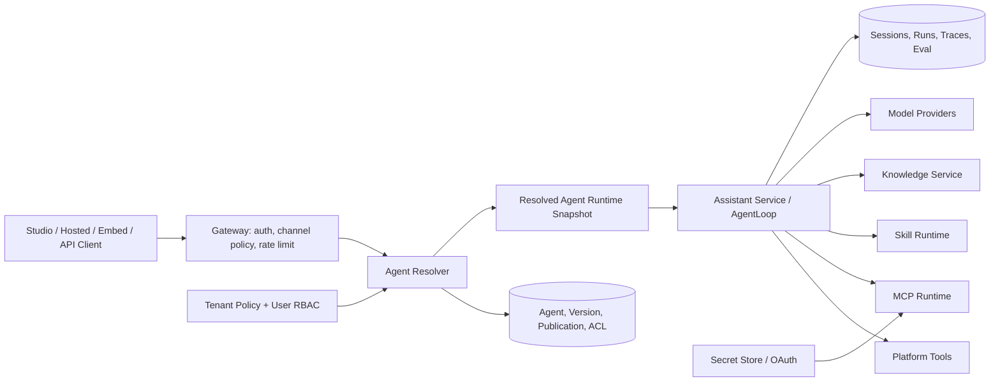
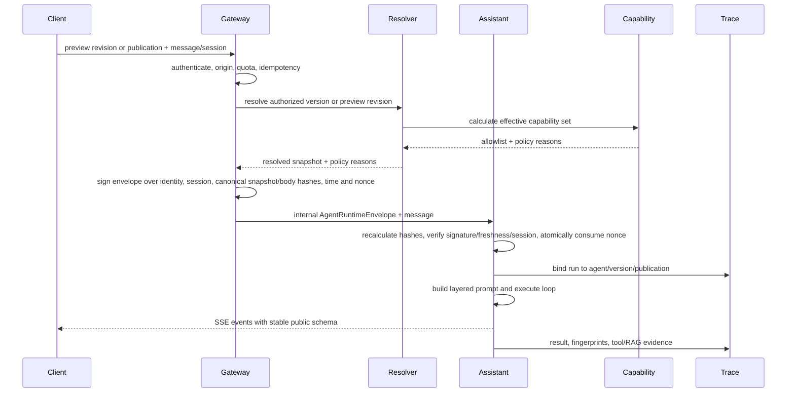

# Agent Studio 架构与数据契约

## 1. 当前实现结论

当前通用 Assistant 已经是可复用 Runtime，但尚不是多 Agent 产品。源码证据表明能力来源是混合架构：

| 能力 | 当前入口 | 当前形态 | Agent Studio 前置缺口 |
| --- | --- | --- | --- |
| 对话 Runtime | `apps/assistant-service/src/assistant_service/core/assistant_service.py`、`core/agent/agent_loop.py` | 独立 Assistant Service | 缺少 Agent Version Resolver 和会话版本绑定 |
| 平台工具 | `core/tools/tool_registry.py`、`main.py` | 进程级 ToolRegistry | `tools_enabled` 未形成强制白名单；需租户/Agent 隔离 |
| 联网搜索 | 模型 Provider 配置；`web_fetch` 原生工具 | Qwen/Anthropic 模型原生搜索 + URL fetch | 不能当作 MCP；需按 Agent/渠道策略控制 |
| 知识库 | `search_knowledge_base` + KB Proxy | 原生工具代理知识服务 | 仅请求/会话选择，缺 Agent Version 绑定 |
| Skills | Gateway Skills API + Assistant `SkillToolBridge` | DB 元数据 + 运行时桥接 | 完整版本内容、持久化错误和租户缓存隔离不足 |
| MCP | `core/mcp/*`、`config/mcp_servers.yaml`、Gateway `/mcp` | 管理器和配置存在 | 当前组合根未初始化 MCPManager，Gateway state 为 `None` |
| Connectors | Confluence DB 工具 + Gateway Connector MCP service | 两种并存路径 | 需统一目录语义和单一运行授权路径 |
| 会话 | `__builtin_assistant__` | 保留 service identity + JSON config | 缺 `agent_id`/`version_id`/channel 强类型绑定 |
| Trace/Eval | `assistant_runs`、`agent_traces`、Eval API | 已有完整基础设施 | 缺 Agent/Version/Publication 可查询维度 |

结论：Agent Studio 不应把现有工具全部迁移成 MCP。MCP 是能力来源之一；统一点应是“能力目录、版本绑定、策略交集和审计”，不是强行统一传输协议。

## 2. 目标组件边界



### 组件所有权

| 组件 | 所有者 | 职责 | 不负责 |
| --- | --- | --- | --- |
| Gateway | `src/api/v1/*` | 认证、RBAC、渠道 Token、Origin、限流、Agent/Publication 权威解析、签发内部 Runtime Envelope | 直接执行 AgentLoop、保存明文 Secret、透传客户端自带 Agent 配置 |
| Agent Resolver | Gateway + shared core | 将已授权 Version/Preview Draft 解析成不可变 Snapshot，计算策略上限并签发绑定请求体/会话的 Envelope | 修改 Draft、隐式升级资源版本、接收公网直连 |
| Assistant Service | `apps/assistant-service` | 验证内部 Envelope、再次执行 fail-closed 能力/资源检查、Prompt 组装、模型流式调用、工具循环、会话和 Trace | 直接信任客户端或未签名 Gateway body 中的 model/Prompt/capability/snapshot |
| Capability Catalog | Gateway + shared persistence | 汇总平台/MCP/Skill/Connector/KB 的可授权元数据 | 将所有来源转换为 MCP |
| Knowledge Service | `apps/knowledge-service` | Dataset 权限内检索、revision fingerprint | Agent 生命周期和发布 |
| Eval/Trace | Existing eval stack | 不可变配置评测、live-content provenance、运行证据、发布门禁 | 由前端声明通过，或在缺少历史内容读取时声称能确定性重放 KB |

## 3. 数据模型

所有表必须包含 `tenant_id`，所有 Repository 查询必须同时约束租户。UUID 只用于标识，不作为授权。

### 3.1 核心实体

| 表/实体 | 关键字段 | 不变量 |
| --- | --- | --- |
| `agents` | `tenant_id`, `agent_id`, `slug`, `name`, `owner_id`, `status`, `current_draft_id`, timestamps | 稳定身份；`(tenant_id, agent_id)` 与 slug 租户内唯一；软删除 |
| `agent_members` | `tenant_id`, `agent_id`, `principal_type`, `principal_id`, `role` | 复合 FK 到同租户 Agent；至少一个 Owner；租户内 principal |
| `agent_drafts` | `tenant_id`, `draft_id`, `agent_id`, `revision`, `spec`, `updated_by` | 复合 FK；每 Agent 一个活动 Draft；revision 单调增长；乐观锁 |
| `agent_draft_knowledge_bindings` | `tenant_id`, `draft_id`, `dataset_id`, `retrieval_config` | Draft 编辑态的规范化反向引用；保存时校验 Dataset 租户/权限 |
| `agent_versions` | `tenant_id`, `agent_version_id`, `agent_id`, `version_number`, `resolved_spec`, `spec_hash`, `created_by` | 复合 FK；创建后不可变；Agent 内 version_number 唯一 |
| `agent_version_capabilities` | `tenant_id`, `agent_version_id`, `capability_type`, `resource_id`, `resource_version`, `schema_hash`, `config` | 复合 FK；仅保存已授权且已解析的引用 |
| `agent_version_knowledge_bindings` | `tenant_id`, `agent_version_id`, `dataset_id`, `retrieval_config` | 固定 Dataset 身份/配置；支持撤权/删除保护和反向查询，不保存内容快照 |
| `agent_publications` | `tenant_id`, `publication_id`, `agent_id`, `channel`, `public_id`, `version_id`, `auth_mode`, `policy`, `status` | 复合 FK；渠道稳定入口；指针原子更新；public_id 全局不可猜测 |
| `agent_publish_events` | `tenant_id`, `event_id`, `publication_id`, `from_version_id`, `to_version_id`, `actor_id`, `reason`, `validation_snapshot` | 复合 FK；仅追加审计 |
| `agent_api_tokens` | `tenant_id`, `token_id`, `publication_id`, `token_hash`, `scopes`, `expires_at`, `revoked_at` | 复合 FK；仅保存 hash；原值只显示一次 |
| `mcp_servers` | `tenant_id`, `server_id`, `name`, `url`, `transport`, `policy`, `status` | Server 定义与凭证分离；V1 用户配置只允许 Streamable HTTP |
| `mcp_connections` | `tenant_id`, `connection_id`, `server_id`, `credential_mode`, `principal_id`, `created_by`, `secret_or_token_ref`, `scopes`, `audience`, `expires_at`, `revoked_at`, `status` | `service_account` 或 `user_delegated`；无明文 Token；grant owner 不可混用；撤销可审计并立即失效 |
| `mcp_tool_snapshots` | `tenant_id`, `server_id`, `tool_id`, `schema`, `schema_hash`, `discovered_at`, `status` | 复合 FK；schema 变化可审计；发布引用精确 hash |

Draft 的 `spec` 便于编辑；Version 同时保存规范化绑定行和 `resolved_spec JSONB`。规范化行负责授权、反向引用和删除保护，快照负责确定性配置运行和审计。不得只保留 JSONB 后在运行时临时解析当前资源。

每个 tenant-owned 子表都必须显式保存 `tenant_id`，父表提供 `(tenant_id, object_id)` 唯一键，子表使用复合外键；迁移测试必须尝试把 Tenant A 子行指向 Tenant B 父行并证明数据库拒绝，而不只测试 API 查询过滤。

### 3.2 现有表的加法迁移

对 `assistant_runs`、`agent_traces` 和会话存储添加可空字段：

```text
agent_id UUID NULL
agent_version_id UUID NULL
publication_id UUID NULL
channel TEXT NULL
runtime_fingerprint TEXT NULL
```

迁移期现有 `__builtin_assistant__` 记录保持空值；新 Agent Studio 运行必须非空。使用局部索引和外键策略避免阻塞历史数据。不得重解释 `service_id` 为 `agent_id`。

### 3.3 Resolved Agent Runtime Snapshot 与签名 Envelope

```json
{
  "schema_version": "agent-runtime/v1",
  "tenant_id": "tenant-uuid",
  "agent_id": "agent-uuid",
  "agent_version_id": "version-uuid",
  "publication": {
    "id": "publication-uuid-or-null",
    "channel": "preview|hosted|embed|api|builtin",
    "auth_mode": "private|tenant|public|token"
  },
  "model": {
    "id": "qwen3.7-plus",
    "provider": "dashscope",
    "parameters": {"temperature": 0.7, "max_tokens": 4096}
  },
  "instructions": {
    "agent": "immutable owner instructions",
    "prompt_hash": "sha256:..."
  },
  "capabilities": [
    {
      "type": "platform|mcp|skill|connector",
      "id": "stable-id",
      "version": "version-or-null",
      "schema_hash": "sha256:...",
      "risk": "low|medium|high|critical",
      "config": {}
    }
  ],
  "knowledge": {
    "datasets": ["dataset-uuid"],
    "retrieval": {"mode": "hybrid", "top_k": 5, "threshold": 0.4}
  },
  "memory": {"mode": "session"},
  "channel_policy": {
    "attachments": true,
    "high_risk_tools": false,
    "allowed_origins": []
  },
  "fingerprints": {
    "spec": "sha256:...",
    "tool_schema": "sha256:...",
    "skills": "sha256:...",
    "knowledge_revision": "sha256:..."
  }
}
```

Snapshot 由 Gateway Resolver 生成；客户端不能通过通用 `/assistant/chat/stream` body 提交 Agent 的 model、Prompt、capabilities 或 resolved snapshot。`AgentRuntimeEnvelope` 必须携带该规范化 Snapshot，而不是让 Assistant 按客户端字段或可变 Draft 再解析一次。

外部请求只有两种身份入口：

- Preview：路径中的 `agent_id` + body 中的 `draft_revision`、message/session/allowed attachments。
- Published：路径中的 `publication_id` 或 `public_id` + message/session/allowed attachments。

Gateway 在 tenant/ACL/channel/origin/quota 校验后签发内部 `AgentRuntimeEnvelope`。Envelope 至少包含 `tenant_id`、`caller_principal`、`agent_id`、`agent_version_id`、`draft_revision`、`publication_id/channel`、`session_id`、规范化 `resolved_snapshot`、`request_body_hash`、`spec_hash`、`issued_at`、`expires_at` 和一次性 `nonce`；签名必须覆盖这些字段及 canonical Snapshot。Assistant 重算 request body 与 Snapshot hash，验证签名、时间窗、session 绑定，并在租户/issuer 范围的短 TTL store 中原子消费 nonce；任何重复消费、字段/快照替换或公网客户端伪造的 `X-Agent-*` 头/保留字段都失败关闭。Gateway 是 Agent 身份/Version 的唯一外部解析权威，Assistant 是实际执行和资源 fail-closed enforcement 权威。

## 4. 运行时解析与授权

### 4.1 能力交集

```text
effective_capabilities =
  tenant_policy.allow
  ∩ agent_version.bindings
  ∩ publication.channel_policy
  ∩ caller.permissions
  ∩ capability.setup_and_health
  − tenant_policy.deny
  − publication.channel_policy.deny
```

`deny` 优先；任何服务超时、缓存缺失、对象找不到、授权结果未知都按 deny 处理。Tool Selector 只能在 `effective_capabilities` 内做相关性筛选，不能把未绑定工具重新加入。

### 4.2 Prompt 层次

从高到低：

1. 平台不可修改的安全、租户隔离和工具使用约束。
2. 不可变 Agent Version Instructions。
3. Publication 渠道、语言和品牌上下文。
4. 实际生效的能力说明与审批规则。
5. 允许的长期记忆、知识库检索和附件上下文。
6. 对话历史与当前用户输入。
7. 工具、网页、文件、Skill 资源和知识库返回的外部数据。

外部数据中的“忽略之前指令”等文本不能提升层级。Trace 保存各层 hash 和安全分类，不默认保存不可脱敏的完整 Secret/PII。

### 4.3 请求流程



现有通用 Assistant route 保持原契约，但必须拒绝 Agent 保留字段；Preview/Published Agent 走独立 Gateway route/schema。共享签名必须覆盖 Envelope 与请求体，而不是只证明“请求来自 Gateway”。

## 5. API 契约草案

前缀沿用 `/api/v1`。具体 Pydantic 类型在 AS-01 固化 OpenAPI；以下资源名与语义是稳定需求。

| 方法 | 路径 | 作用 | 关键约束 |
| --- | --- | --- | --- |
| `GET/POST` | `/agents` | 列表/创建 | Tenant scope；游标分页 |
| `GET/PATCH/DELETE` | `/agents/{agent_id}` | 详情/元数据/归档 | ACL；软删除 |
| `GET/PUT` | `/agents/{agent_id}/draft` | 读写 Draft | `If-Match` revision；409 冲突 |
| `POST` | `/agents/{agent_id}/validate` | 校验 Draft | 只读；返回字段与资源错误 |
| `POST` | `/agents/{agent_id}/preview/sessions` | 创建预览会话 | Preview 命名空间和配额 |
| `POST` | `/agents/{agent_id}/preview/chat/stream` | 运行精确 Draft revision | 外部 schema 无 model/Prompt/capability/snapshot override；Gateway 签发 Envelope |
| `GET` | `/agents/{agent_id}/versions` | 版本列表 | 不返回 Secret |
| `GET` | `/agents/{agent_id}/versions/{version_id}/diff` | 结构化差异 | ACL |
| `POST` | `/agents/{agent_id}/publish` | 创建 Version/Promotion | Idempotency key；Eval Gate |
| `POST` | `/publications/{id}/rollback` | 回滚渠道 | 资源复检；审计 |
| `GET/POST` | `/mcp/servers` | MCP 目录管理 | Admin；Secret ref |
| `POST` | `/mcp/servers/{id}/discover` | 发现/刷新 | SSRF 防护；schema diff |
| `GET` | `/capabilities` | 能力选择目录 | 返回 setup/risk/health，不返回 Secret |
| `POST` | `/public/agents/{public_id}/sessions` | Hosted/Embed 会话 | 渠道认证、Origin、限流 |
| `GET` | `/embed/agents/{public_id}` | 专用 iframe 文档 | 服务端生成 Publication-specific `frame-ancestors`；无 SAMEORIGIN XFO |
| `POST` | `/agent-runtime/{publication_id}/chat/stream` | Server API 流式运行 | Scoped token；SSE |
| `POST` | `/agent-runtime/{publication_id}/feedback` | 反馈 | Session/Run 归属校验 |

所有 mutation 返回 `request_id`/审计引用；错误使用稳定代码，例如 `AGENT_DRAFT_CONFLICT`、`CAPABILITY_NOT_AUTHORIZED`、`MCP_SCHEMA_CHANGED`、`PUBLICATION_DISABLED`、`ORIGIN_NOT_ALLOWED`。

## 6. MCP 契约

- V1 用户配置的远程传输只支持 MCP Streamable HTTP；本地 `stdio` 只允许平台受控部署，不暴露给租户输入。
- Client 必须校验 URL、重定向、DNS 解析、响应大小、Content-Type、协议版本和 Origin；服务端接受请求时也校验 Origin。
- OAuth 使用 Authorization Code + PKCE，遵循资源元数据发现；Token 只发送给其受众 MCP Resource。
- Server 定义与 Credential Connection 分离。`service_account` 由 Tenant Admin 拥有；`user_delegated` 以 `(tenant_id, server_id, user_id)` 解析当前用户自己的 grant，记录 scope/audience/refresh/revoke，绝不回退到管理员或其他用户 grant。
- 匿名 Hosted/Embed 默认不能使用 delegated grant 或 service account；若 Admin 明确允许某个只读 service-account tool 进入 public/embed，Publication 必须保存这一渠道授权且 ToolInvoker 继续执行 scope/risk/approval 交集。
- `tools/list` 结果写入 snapshot；收到 `notifications/tools/list_changed` 或管理员刷新时生成差异，不原地修改已发布 Version。
- Tool 调用键由 `tenant_id + server_id + tool_id + schema_hash` 唯一确定；日志使用稳定 ID，不能只依赖可改名的展示名。
- MCP Server 连续失败进入熔断；健康恢复不会自动绕过已发布 schema hash 校验。
- 现有平台 Connector（当前包括 Confluence）采用相同的 credential principal/channel contract，并收敛到一个运行授权路径；V1 不新增 Connector 类型。
- Connector capability 存在两种绑定模型：(a) **grant 绑定**——config 携带 `grant_id` + `principal_type`，走 credential principal 授权（scope/audience/channel/owner 交集，失败码 `CONNECTOR_CAPABILITY_UNAVAILABLE`/`CONNECTOR_DELEGATED_PRINCIPAL_DENIED`/`CONNECTOR_CHANNEL_DENIED`/`CONNECTOR_SCOPE_DENIED`）；(b) **catalog 绑定**——config 只携带 `provider` + `tool_name`（无 grant）。创建 Version/发布前先验证 provider 在 `connector_configs` 有启用且非 ingest-only 的可见行；Gateway Capability Resolver 与 Assistant 执行时再次校验 provider 行（tenant 行优先于全局行）**且** 调用用户持有该 provider `status='connected'` 的 `user_connectors` 行，否则该能力被剥离（fail closed）。
- catalog 绑定的稳定拒绝码：`CONNECTOR_CATALOG_UNAVAILABLE`（无启用配置）、`CONNECTOR_CATALOG_INGEST_ONLY`（mode=`ingest` 的 provider 不作为 live 工具暴露）、`CONNECTOR_CATALOG_PRINCIPAL_DENIED`（匿名调用或 public/embed 渠道）、`CONNECTOR_CATALOG_NOT_CONNECTED`（用户未连接或连接非 connected 状态）。
- catalog 连接本质是 user-delegated：公共渠道与匿名流量一律拒绝，不与 grant 绑定的渠道策略做隐式降级。
- Assistant 侧必须重复 catalog 授权查询；发布校验、Gateway 解析和 Assistant 调用三层均为收窄边界，任一层不可用或不满足连接状态都拒绝，且带有任一 grant 字段的半绑定不得降级为 catalog 绑定。

## 7. Skills 与知识库契约

### Skills

- Skill 工作区资源与 Agent Version 绑定分离。
- `assistant_skill_versions.content` 保存完整规范化 SKILL.md，Runtime 以 `skill_version_id` 加载；进程缓存键至少包含 tenant/user/version。
- 租户上传 Skill 是 instruction-only 制品：服务端拒绝用户声明的 `entrypoint`/`source` 以及 `builtin://`、path、network、exec schemes，并规范化为 `db://<skill_id>/<version_id>`。Bundled executable Skill 是平台部署清单控制、hash 固定且租户 API 不可覆盖的另一制品类别。
- Skill 生成的工具声明仍进入 Capability Resolver；Skill 内容不能动态注册未授权全局工具。
- 启停/删除新版本对历史 Version 的含义：禁用或撤权立即阻止执行；普通内容更新只影响新发布版本。

### 知识库

- Version 固定 Dataset IDs 和检索参数，不复制向量或文档。
- Resolver 在保存、发布、运行三个时点检查租户权限。
- 每次运行从 Knowledge Service 获取 revision fingerprint 并写 Trace；这提供当次 provenance 和漂移定位，不提供历史内容重放。确定性回归必须使用固定 fixture/保留的检索证据；只有 Knowledge Service 未来支持按历史 revision 读取后，才可声称生产 live-content 可重放。
- RAG 不可用时返回明确 provenance 状态；模型回答不得伪装成已检索结果。

## 8. 渠道与认证

| 渠道 | 身份模式 | 默认记忆 | 高风险工具 | Secret 交付 |
| --- | --- | --- | --- | --- |
| Preview | Owner/Editor 登录 | session，可显式 user | 依 Agent 和用户审批 | 不下发 |
| Hosted private | 平台登录 + ACL | user/session | 可审批 | 不下发 |
| Hosted public | 匿名或一次性签名 | session | 默认禁用 | 不下发 |
| Embed | Origin + public/short-lived token | session | 默认禁用 | 浏览器无 server token |
| Runtime API | Scoped hashed token | 调用方显式 session | 按 token/channel policy | Token 仅服务端持有 |

已有会话继续固定创建时 Version。Publication 升级只影响升级后创建的新会话；若旧 Version 因安全撤权不可运行，旧会话返回 `VERSION_REVOKED`，不得偷换到新 Version。

Hosted 页面 `/a/:publicId` 保持 `X-Frame-Options: SAMEORIGIN` 与 `frame-ancestors 'self'`。只有 `/embed/agents/:publicId` 可被跨域嵌入：该文档由能读取 Publication allowed origins 的服务端响应，移除 SAMEORIGIN XFO，并生成精确 `frame-ancestors`；Nginx 与 Helm 必须把该路径转发到动态响应，而不是让 SPA 全局头覆盖它。

## 9. 可观测性与评测复用

现有 Eval/Trace 是首选扩展点，不建立第二套评测系统：

- `agent_traces` 和 `assistant_runs` 增加 Agent 维度与 fingerprint。
- Eval Candidate 可选择 Draft revision 或 Version；结果记录 resolved spec hash。
- Golden gate 比较回答、工具轨迹、RAG 证据、拒绝行为、成本和延迟。
- 发布报告引用 Eval Experiment/Run ID；前端只呈现服务端结果。
- 按 Agent/Version/Channel 聚合，不从自由文本 metadata 才能查询关键维度。

## 10. 迁移与回滚

1. 添加新表、可空列和索引，不修改现有 `__builtin_assistant__` 语义。
2. 在功能开关下部署 Agent CRUD 与 Resolver，现有 Assistant 仍走原路径。
3. 将内置 Assistant 可选地表示为只读保留 Agent，但不反向迁移历史会话。
4. Agent Studio 新流量逐步启用；任何阶段可关闭入口并保留现有 Assistant。
5. 数据迁移脚本必须幂等；Schema 回滚优先停用代码和保留新增列，避免破坏审计/历史 Version。
6. Publication 回滚与应用部署回滚是两个独立机制，报告必须分别验证。

## 11. 架构不变量

以下任一被破坏都阻断发布：

1. Agent Version 创建后不可变。
2. Gateway 只接受精简外部 Agent 请求并签发携带 canonical Snapshot、绑定 identity/session/body/spec/time/nonce 的 Envelope；Assistant 重算 hash、原子消费 nonce，不信任客户端或未签名请求提交的能力、Prompt、Version 内容。
3. 所有对象访问同时校验 tenant 和 ACL，tenant-owned 子表用显式 `tenant_id` 与复合外键阻止跨租户父子引用。
4. 所有 Secret 只通过引用解析，绝不进入 Agent Spec。
5. Tool Selector 不能扩大 Capability Resolver 的 allowlist。
6. 会话固定 Version，Publication 升级不静默改变正在进行的会话。
7. MCP/Connector 凭证明确区分 service account 与当前用户 delegated grant，不得跨用户、跨渠道或向匿名流量隐式降级。
8. 租户上传 Skill 只能是 instruction-only `db://` 制品，不得声明可执行、本地、网络或 bundled 入口。
9. 资源撤权优先于版本可复现性，必须 fail closed。
10. Live Knowledge revision 只承诺 provenance/漂移定位；没有历史 revision 读取时不声称可确定性重放内容。
11. 每次运行可通过结构化列和 fingerprints 追溯到确定配置。
12. 现有 Assistant 在迁移开关关闭时保持原行为。
