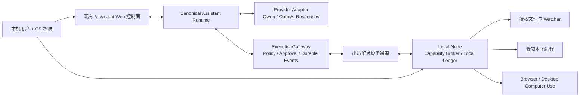

# AI Assistant Local OS：Codex 最终结果契约

> 状态：可直接作为 AI 实现输入
>
> 基线：`AI--Platfform` `main@e0983ce01746b818468bf7b466e01a243c716ded`，2026-08-12 现行工作树
>
> 适用范围：单个 Codex 工作日内可验收的本地开发版本
>
> 文档类型：最终结果、验收标准、执行边界；不规定代理数量、角色、顺序、工时或实现步骤

## 1. 最终产品定义

当前 `/assistant` 必须从“只能通过服务端工具工作的 Web 聊天助手”变成一个**有本地执行面的个人 Agent Runtime**：

- Web 页面是主要对话与运行控制面，负责设备与工作区选择、实时状态、审批请求、接管、停止、结果和审计；涉及 OS 授权及中高风险副作用时，目标设备上的 Local Node 可信界面是最终确认面。
- 用户设备上存在一个受信任的 **Local Node**。它只执行经用户授权、经平台策略判定、与当前审批快照一致的本地文件、受限进程和 Computer Use 动作。
- Assistant 能实时感知用户明确授权目录中的文件变化，按需读取、搜索和修改文件；不会默认扫描或上传整台电脑。
- Assistant 能在真实浏览器和至少一个真实桌面 App 中完成可观察动作，并以截图、可访问性状态或应用状态回读证明结果。
- OpenAI Responses API 的 GA `computer` tool 可以作为一个模型侧 Computer Use 驱动；系统同时保留 provider-neutral 的标准动作协议，默认 Qwen 路径不能因此失效。
- 所有本地动作继续经过本项目唯一的 canonical AgentLoop、ExecutionGateway、CapabilityAllowlist、审批和事件投影；不得为 OpenAI 或本地设备另建第二套 agent loop。

这里的“OS 化”指 Assistant 成为连接模型、文件、进程、应用、权限、状态与审计的**操作层**，不指开发操作系统内核，也不等于无限权限的远程桌面。

最终逻辑拓扑如下；箭头表示受认证、受策略约束的请求或事件，不表示任何组件天然拥有另一组件的权限。



## 2. 研究结论与本项目取舍

### 2.1 已确认事实

| 观察对象 | 已确认能力或限制 | 本项目结论 |
|---|---|---|
| 当前 AI--Platfform | `fs_read/fs_write/fs_glob/fs_grep` 只访问 `ASSISTANT_WORKSPACE_ROOT` 下的服务端 tenant/session workspace，默认根为 `/tmp/ai-gateway-workspace`；不是用户 Mac/PC 文件系统 | 保留现有服务端 workspace，并新增名称和权限都明确区分的 Local Node 能力 |
| 当前 `/v1/responses` | 是 canonical Assistant AgentLoop 的严格传输适配器，明确不是第二个 loop，且不接受客户端自定义工具回调语义 | 不把现有入口伪装成 OpenAI 原生 Computer Use 透传；Computer Use 必须成为 canonical runtime 内的 provider/tool adapter |
| 当前前端 | `/assistant` 已有运行状态、工具事件、审批状态、任务时间线和 artifact 基础组件；当前发送参数仍固定 `os_agent_enabled: false`，文件流程是浏览器上传而非本地实时读取 | 扩充现有控制面，不另造一套脱离会话的桌面应用 UI；不能把上传文件包装成实时本机能力 |
| OpenClaw | 现行公开版为 `v2026.7.1-2`；Local-first Gateway、设备配对和 host tools 完整，Computer Use 经 paired node 工作，macOS 原生而 Windows/Linux 仍标实验性；sandbox 默认关闭 | 采用“一个控制平面 + 配对节点 + 能力真值 + 与动作计划绑定的审批”；不采用默认全主机信任、全局 Gateway token 或 sandbox-off 默认值 |
| Hermes Agent | 现行公开版为 `v2026.8.3 / v0.20.0`；官方文档描述多平台 Computer Use、截图/可访问性与 doctor；本地旧快照实际仅确认 macOS `cua-driver` MCP 封装，且审批 callback 缺失时存在放行风险 | 采用统一 driver contract、权限健康矩阵和安全模式；不照搬 fail-open 审批，也不把文档宣称当作跨平台 live 证据 |
| OpenAI Computer Use | GA `computer` tool 通过 screenshot/action 循环工作，可接内置或自定义 harness；官方要求隔离环境，并在高影响动作保留人工确认 | 把它作为模型侧动作生成器之一；本地执行授权仍由本平台和 Local Node 决定 |

### 2.2 OpenClaw 与 Hermes 的实际实现解剖

以下不是根据宣传页推断，而是官方现行资料与同组本地源码快照的交叉结果。这里记录的是“它们实际把能力放在哪里”，以及本项目应采用或拒绝的部分。

| 实现面 | OpenClaw 实际做法 | Hermes Agent 实际做法 | AI--Platfform 的吸收结果 |
|---|---|---|---|
| 本地运行拓扑 | 常驻 Gateway/Daemon 是统一控制平面；Web Control UI、CLI、消息渠道和配对 node 都连接 Gateway。macOS/Linux/Windows 分别通过 launchd/systemd/Scheduled Task 常驻 | Python CLI/daemon 承载 Agent runtime，本地 FastAPI Dashboard 与 Electron/React Desktop 连接同一运行时；非 loopback Dashboard 要求认证 | 新增受信 Local Node，但不复制第二套 Agent runtime；平台 canonical AgentLoop 保留为唯一编排者，Local Node 只做设备侧 capability broker 和执行器 |
| 设备与远程通道 | Gateway protocol 区分 operator/node，node 配对后声明 capability；请求/响应/事件带 idempotency 和设备身份。官方建议 SSH/Tailscale，避免直接公网暴露 | 本地服务以进程级 session token、loopback CORS 和 Host/Origin 限制保护；Desktop 可以连接远程 `hermes serve` | Local Node 只主动建立出站加密通道；设备声明不等于授权，tenant/user/device/session/run 与签名动作信封共同校验 |
| 文件系统 | `read/write/edit/patch/exec/process` 是宿主工具；多层 tool-policy 决定可见和可执行工具。workspace 默认只是 cwd，只有显式 `workspaceOnly` 才成为边界 | `read_file` 等文件工具是显式模型调用，包含路径、二进制、凭据和重复读取防护；通用 Agent 没有实时 watcher，只有 Electron 文件预览使用 `fs.watch` | 不复制默认宿主访问。采用 OS 目录选择形成的 grant、canonical path/symlink/TOCTOU 防护、watcher revision、按需内容读取和独立数据外发 grant |
| Shell/进程 | exec 支持 foreground/background、host/sandbox/node 路由和进程 registry；Docker sandbox 可只读根、无网络、drop capabilities，但整体 sandbox 默认关闭 | Terminal 是默认本机后端，也支持 Docker/SSH/Singularity/远程 sandbox；安全文档承认真正边界来自 OS/容器而非 denylist | 只提供结构化 `argv + cwd + budget + network policy` 的受限进程执行；最小环境、无宿主 secrets、无 ambient shell，执行面在 UI/trace 中明确 |
| 浏览器自动化 | Browser 是一等工具，支持 DOM/accessibility snapshot、截图、click/type/drag/upload/evaluate，并可路由 host、sandbox 或 remote node | Browser 支持 CDP/accessibility 与多种后端，和桌面 Computer Use 是两个工具面 | 保持 Browser Automation 与 Desktop Computer Use 两种 capability；优先结构化 DOM/accessibility，截图坐标只作最后兜底 |
| 桌面 Computer Use | macOS 通过配对 node 与外部 Peekaboo/TCC Bridge 完成通用 App 操作；不是 OpenAI 原生 `computer` loop，Windows/Linux 仍属实验性 | 本地快照将 macOS `cua-driver` 包装成 MCP stdio，按 session 维护 driver，读取截图/可访问性并注入输入；官方新文档宣称多平台 | 定义 provider-neutral ComputerAction/Observation/Lease contract；macOS 先提供真实证据，其他系统只按 doctor/capability truth 声明，不能虚报 live parity |
| Provider/Responses | OpenResponses HTTP 当前主要接受 function tools，函数仍由客户端执行；没有 GA `computer_call.actions[]` 的截图回传循环 | Codex Responses transport 把 Hermes 工具转换成普通 function tools；本地快照同样没有原生 GA `computer` 适配 | 新增 OpenAI GA `computer` 与 `shell` adapter，但全部映射回标准动作、ExecutionGateway、Local Node 和平台事件，不能把 provider 私有状态当系统事实源 |
| 工具能力解析 | 工具经过全局、provider、agent、group、sandbox、subagent 等多层 deny-first policy；Skills 还有 realpath、大小和数量约束 | Registry/Toolsets 动态发现、检查可用性、处理冲突并做 session 级过滤；MCP include/exclude 决定暴露面 | 复用现有 ToolRegistry、CapabilityAllowlist 和 ExecutionGateway；有效能力是租户、用户、安装、设备、OS 权限、grant、预算和租约的交集，任何插件/MCP/任务只能缩减 |
| 审批 | Exec approval 绑定 argv、cwd、agent、session 和环境摘要，超时默认拒绝；但官方也明确其主要是单一操作员防误触，并非多租户授权边界 | Computer Use 的变更动作会调用 approval callback，但本地快照中 callback 缺失时会放行，且 gateway 未确认统一绑定 | 中高风险审批必须 fail closed，并由目标设备 Local Node 的可信界面最终确认；approval 与参数、目标状态和策略 digest 绑定，缺 callback 等同拒绝 |
| 会话、任务与恢复 | Session 使用 `sessions.json`/JSONL、原子写和跨进程锁；Cron/Automation 有持久 job store，普通 background process registry 仍可能只在内存 | Conversation loop 有有界迭代、中断、steering 和工具 receipt；Cron 有锁和 at-most-once 设计，但运行中进程崩溃不自动恢复 | 本地副作用先写耐久 action ledger；断线后只 read-back 与收敛，不自动重放未知副作用；provider background mode 不替代本地任务事实 |
| Memory | `MEMORY.md`、每日记忆和 SQLite 混合索引分层，文件监听主要服务于记忆索引，不等于实时读取整机 | `MEMORY.md`/`USER.md` 是 session 启动时冻结快照，外部 provider 单独 prefetch/sync；与 transcript 分离 | 文件 watcher、artifact、trace、transcript、checkpoint、KB 和长期 memory 严格分层；本地文件变化不自动进入 memory |
| 已知不能照搬的默认值 | 单一可信操作员、一个 Gateway token 近似全权、sandbox 默认关闭、宿主路径可访问、浏览器 evaluate 权限宽 | ambient terminal、部分审批 fail-open、CUA 子进程继承完整 `os.environ`、MCP 无过滤时暴露全部、自动 memory/skill 写入 | 全部改为 deny-wins、最小授权、设备本地确认、最小环境、外发单独授权、审计先于副作用；没有安全降级就明确 unavailable |

对应当前仓库的落点同样是结果约束，而不是另起系统：

- `apps/assistant-service/src/assistant_service/main.py` 的 ToolRegistry/ToolInvoker composition root 必须继续决定工具可见性与调用入口。
- `apps/assistant-service/src/assistant_service/core/gateway/execution_gateway.py` 必须继续承担策略、副作用、审批和 durable command 边界。
- `apps/assistant-service/src/assistant_service/api/routes/runs_approvals.py` 与现有事件投影必须承载等待批准、恢复、取消和终态。
- `apps/assistant-service/src/assistant_service/api/routes/responses.py` 仍是 canonical AgentLoop 的 transport adapter；OpenAI `computer`/`shell` 不能在这里形成第二套循环。
- `web/src/pages/assistant/` 现有 timeline、approval、artifact 和 run 状态必须扩展为设备/文件/Computer Use 控制面，而不是另建割裂页面。

### 2.3 设计判断

1. **只有 Web 前端不可能获得可靠的全局本地文件和桌面 App 控制。** 浏览器沙箱不具备持久、通用、可审计的主机能力，因此 Local Node 是最终产品的必要组成，不是可选增强。
2. **模型能力不等于设备权限。** 模型可以提出动作；设备身份、目录范围、App 范围、风险、审批、幂等和执行结果必须由运行时裁决。
3. **能力必须按当前 turn 动态编译。** 模型看到的工具集合不得大于“当前用户 + 当前设备 + 当前授权 + 当前在线状态 + 当前策略”真正可执行的交集。
4. **环境结果才是完成。** 模型文本、工具开始事件或 provider 返回成功都不算本地任务完成；必须有文件 hash/diff、应用状态回读、截图闭环或明确的不可验证终态。
5. **本地状态与长期记忆分离。** 文件内容、屏幕截图、运行日志、会话 transcript、checkpoint、trace 与长期 memory 是不同数据层，不能因执行一次任务就自动互相写入。

## 3. 必须交付的最终用户体验

### 3.1 设备与权限中心

`/assistant` 必须能够：

- 显示已配对设备、在线状态、操作系统、Local Node 版本、最后心跳和可用能力。
- 通过一次性、短时效配对凭据建立设备身份；设备凭据绑定 tenant、user、device 和 scope，可单独撤销。
- 显示操作系统权限健康矩阵：文件目录、屏幕录制、辅助功能/可访问性、自动化、受限进程等权限分别为 `ready / denied / needs_action / unsupported`。
- 允许用户选择本次会话使用的设备、一个或多个授权工作区、允许操作的 App 和允许访问的域名。
- 每项授权都能立即收回；收回后，新动作必须拒绝，尚未开始的动作必须取消，运行中的动作必须尽快停止并留下终态。
- OS 权限授予、设备配对、中风险及更高风险副作用必须在 Local Node 的本机可信提示中确认；Web 卡片同步展示原因和结果，但不能独自伪造设备本地确认。
- Local Node 离线时仍能正常聊天、使用 KB、MCP 和服务端工具；本地能力必须显示为不可用，不能被模型“想象”为可用。

### 3.2 本地文件能力

必须提供下列结果级能力，且名称不能与现有服务端 `fs_*` 混淆：

- 列出授权目录及其子树中的文件和必要元数据。
- 按需读取文本文件的精确内容、编码、大小、修改时间和内容 hash。
- 按文件名、glob 和内容搜索；结果必须包含相对路径、匹配位置与截断声明。
- 监听 `create / modify / delete / rename`，在 UI 中实时更新；变化只上报必要元数据，正文仍按需读取。
- 以 patch 或完整替换方式写入；写入前展示目标路径、差异、原始 hash 和预期结果。
- 写入采用原子语义；成功返回 before/after hash、diff 和可用时的恢复引用。
- 文件在审批后、执行前发生变化时，旧审批失效，动作以 `stale_target` 终止，不得覆盖新内容。
- 二进制文件默认只读元数据；需要读取或上传时必须单独说明类型、大小、去向并获得许可。

所有路径都必须以 canonical path 在授权根目录内解析。`..`、绝对路径绕过、Unicode/大小写混淆、硬链接或 symlink 逃逸都必须拒绝。授权目录中的 symlink 不能成为访问授权目录之外数据的通道。

### 3.3 受限本地进程能力

为使 Assistant 能验证代码和产生真实结果，Local Node 必须支持**受限的进程执行**：

- 请求使用结构化 `argv`、明确 `cwd`、超时、输出预算和所需网络策略；默认不接受未解析 shell 字符串。
- `cwd` 必须属于当前授权工作区；进程只能继承最小环境变量集合，不得自动继承 provider key、SSH agent、云凭据或用户完整 shell profile。
- 默认禁止 `sudo`、提权、登录 shell、系统服务修改、包管理器全局安装和访问未授权目录。
- stdout/stderr 必须流式显示、可取消、有限额，并在结束时产生 exit code 与唯一终态。
- 网络默认关闭或受域名策略约束；任何扩大网络或主机权限的请求都必须被视为新的授权。
- 进程执行不能复用当前 Docker `code_executor` 的“成功”来冒充本地主机执行；两种执行面必须在 UI 和 trace 中明确区分。

### 3.4 Computer Use 与 App 操作

系统必须暴露统一、provider-neutral 的动作集合，至少覆盖：

- `screenshot`
- `observe_accessibility`
- `click`
- `double_click`
- `type_text`
- `key_press`
- `scroll`
- `drag`
- `wait`
- `open_app`
- `focus_app`
- `stop`

最终体验必须满足：

- 用户能看到当前控制的设备、App/窗口、最近截图、动作说明、执行状态和下一项待审批动作。
- 每个动作都包含执行前观察引用；坐标动作还包含截图尺寸、缩放信息和目标窗口身份，避免在窗口变化后点击错误位置。
- 对同一目标优先使用已授权的结构化 connector/plugin/MCP，其次使用 DOM/可访问性语义动作，最后才使用截图坐标动作；UI 必须显示实际执行驱动，任何驱动都受相同能力上限约束。
- 动作后必须重新观察；只有 read-back 与目标一致时才可标记成功。
- 同一设备同一时刻最多有一个主动 Computer Use 控制租约，避免两个 run 同时争抢鼠标和键盘。
- 用户手动接管、点击“停止”、切换设备或关闭租约时，后续动作不得继续执行；UI 必须在 2 秒内显示已停止或明确的停止失败。
- Local Node 必须提供本机托盘、菜单栏或等价可信浮层，持续显示 `observing / awaiting_approval / controlling / paused`，并提供不依赖 Web 连通性的紧急停止。
- 至少在真实浏览器和一个真实桌面 App 中完成端到端任务。只操作网页、只返回截图、只调用 mock driver 或只让模型描述动作均不达标。
- 当前一天范围接受在本机 macOS 上提供真实 live 证据；Windows/Linux 必须通过能力探测正确显示支持或不支持，但不要求伪造跨平台 live 成功。

### 3.5 审批与高风险动作

审批必须发生在**风险即将发生时**，并绑定动作的不可变摘要。中高风险审批以 Local Node 的本机可信界面为准，Web 同步显示。审批界面必须显示：

- 哪个 run、哪个设备、哪个 App/文件/域名将被操作。
- 精确动作或 patch、参数摘要、目标当前状态 hash、需要向哪个 provider/站点发送什么数据。
- 风险原因、可撤销性、预计影响和批准范围：仅本次、当前会话、当前工作区或预先定义的窄规则。

下列动作必须逐次确认，不能被“自动批准”、历史批准、模型文本或 unrestricted 标志绕过：

- 删除或覆盖用户数据；批量移动、重命名或权限改变。
- 安装或运行下载的软件、脚本、扩展、宏或不可信二进制。
- 发送消息、发布内容、提交表单、发起购买、转账、订阅或其他对外承诺。
- 修改账号权限、安全设置、系统设置、登录项、服务或网络配置。
- 读取、复制或发送密码、令牌、私钥、钱包、浏览器凭据、身份材料或其他高敏感数据。
- 跨出既有目录、App、域名、网络或命令范围。

密码输入、验证码、CAPTCHA、生物识别、最终安全提示和第三方身份确认必须交还用户。Local Node 不得读取或记录密码框内容。

### 3.6 实时运行视图

现有 Assistant timeline、approval、artifact 和 run 状态必须统一呈现本地动作：

- 一条 run 时间线同时容纳模型事件、服务端工具、本地文件、本地进程、Computer Use、审批、用户接管和最终结果。
- 本地动作至少有 `proposed / policy_check / awaiting_approval / dispatched / running / observed / succeeded / failed / cancelled / interrupted / unknown` 状态。
- 网络断开或进程崩溃不能产生伪成功。无法确认副作用是否发生时必须使用 `unknown`，并向用户显示 read-back 或人工核查入口。
- 刷新页面或 SSE 重连后，已完成事件和待审批状态可恢复；provider 的临时 streaming 不是系统事实源。
- Artifact 面板显示 patch、文件、命令输出、截图和恢复引用；敏感字段默认脱敏。

## 4. 必须成立的系统契约

### 4.1 Local Node 信任契约

Local Node 必须满足：

- 默认只建立向平台控制面的出站加密连接，不开放公网入站管理端口。
- 设备首次配对使用短时效、单次使用的挑战；长期凭据保存在操作系统安全存储中，不进入浏览器 localStorage、日志或模型上下文。
- 设备声明的 capability 只是信号，不是授权。服务端 allowlist、用户 grant、OS 实际权限与节点实时健康共同决定有效能力。
- 每个请求校验 tenant、user、device、session、run、有效期和 nonce/idempotency key；跨 tenant 或跨 user 请求 fail closed。
- 节点只接受平台签发且完整性校验通过的动作信封；模型生成的 JSON 不能直接成为主机命令。
- 每个副作用在 dispatch 前必须写入本地耐久 action ledger；中高风险动作在 ledger 不可用时 fail closed。ledger 记录意图摘要、策略结论、批准凭据、前后状态和唯一终态，并能检测事件删除、篡改或重排。
- 撤销、过期、重新配对、版本不兼容和时钟异常都有显式错误码与审计事件。

### 4.2 标准动作信封

每个有副作用的请求至少包含：

```text
action_id
idempotency_key
tenant_id
user_id
session_id
run_id
agent_id
agent_version
call_id
device_id
envelope_version
capability
tool_name
operation
capability_lease_id
resource_refs[]
arguments_digest
target_snapshot_digest
policy_snapshot_digest
nonce
issued_at
expires_at
platform_key_id
platform_signature
trusted_local_approval_receipt | null
trace_context
```

其中 `normalized_arguments` 不作为可变旁路字段进入授权，而是先被规范化并
以 `arguments_digest` 绑定；本地执行器必须对收到的参数重新计算 digest。
`trusted_local_approval_receipt` 由目标设备可信界面单独签名并绑定
`device/action/arguments/target/policy/nonce/expiry`。平台收到该 receipt 后必须
把它附在最终动作信封中重新签名；浏览器/Gateway approval 不等于本机批准，
也不能给已经签名的信封后贴 receipt。

Local Node 的结果至少包含：

```text
action_id
status
started_at
ended_at
normalized_result
before_digest | null
after_digest | null
observation_ref | null
artifact_refs[]
rollback_ref | null
redactions[]
error_code | null
error_detail_safe | null
```

重复 `idempotency_key` 只有在完整平台签名信封 digest（含 tenant/user/device/
session/run/agent/version/tool/operation/lease/resource/approval）完全一致时才可
返回同一已知结果；其他情况必须显式冲突，不能重新执行副作用。审批必须绑定
`arguments_digest + target_snapshot_digest + policy_snapshot_digest`；其中任一值变化即要求重新审批。本机批准 nonce 只能消费一次。

### 4.3 Provider 适配契约

- canonical AgentLoop 只消费平台标准工具定义、标准动作与标准结果，不依赖某个 provider 的私有事件作为事实源。
- OpenAI GA `computer` call 和 screenshot/action 循环必须映射为标准 Computer Use 动作；`pending_safety_checks` 必须进入平台审批，不得自动回传已确认。
- OpenAI GA `shell` 的 local environment call 必须映射为同一受限 `process.run` 执行面；OpenAI 只提供 call/output 协议，不能因此绕过 Local Node 的 cwd、环境、网络、预算和审计策略。
- 非原生支持 `computer` 的模型可通过平台 function tools 产生相同标准动作；它们受完全相同的授权和审计。
- OpenAI provider 不可用时，默认 DashScope/Qwen 聊天、KB、MCP、Skills、服务端工具和 Local Node 的非原生工具路径仍可工作。
- 平台现有 `/v1/responses` 公共契约不得被破坏，也不得声称兼容其尚未实现的 `store`、`previous_response_id` 或客户端工具回调语义。
- Provider background mode 只能作为推理执行选项，不能替代本平台 durable run、审批、设备租约或本地动作账本。

### 4.4 能力解析契约

模型在每个 turn 可见的本地能力必须等于以下集合的交集：

```text
tenant policy
∩ user role
∩ trusted installation/profile
∩ paired device capability
∩ OS permission health
∩ session grants
∩ run budget
∩ current online/lease state
```

每个 turn 必须保存可追踪的 `context_snapshot` 或等价摘要，记录模型实际看见的工具、设备、工作区、App、域名和策略版本。模型不得看见无法执行的本地工具；设备离线、授权撤销或权限变化必须在安全的 provider-turn 边界更新能力真值。

能力必须是“动作 + 资源 + 约束”的原子 grant，至少区分 `file.list/read/watch/write/delete`、`process.run`、`screen.observe/share`、`app.observe/control/submit`、`network.fetch/upload` 和 `credential.use`。读取本地数据与把数据发往外部是两个独立 grant；空集合代表真正零本地工具权限。任何任务、插件、Skill、MCP 或 provider 只能缩减既有能力，不能通过声明新工具扩大它。

### 4.5 数据与隐私契约

- 默认不上传整个目录、完整屏幕历史、浏览器 profile、剪贴板历史或长期日志。
- 目录 watcher 只发送完成实时体验所需的路径相对信息和变化元数据；内容在被任务明确需要且策略允许时才读取。
- 任何将本地内容发送给模型 provider、MCP、connector、网站或其他外部目标的动作，都必须能回答“发送了什么、发给谁、为何需要”。
- 密钥、密码、cookie、私钥、助记词和常见 credential 文件默认禁止读取与外发；脱敏发生在日志、trace、artifact 和 provider 输入之前。
- 截图和可访问性树采用最短必要保留期；用户可从 UI 清除本地运行 artifact。清除动作不得伪装成已删除第三方/provider 已保留的数据。
- 本地文件不会自动进入长期 memory 或 KB；只有用户明确要求或既有 KB ingestion 流程授权时才能持久化。

### 4.6 失败、取消与恢复契约

- 每个 action 恰好一个可审计终态；`unknown` 是合法终态，伪成功不是。
- 用户取消必须传播到待审批、provider call、Local Node、子进程和 Computer Use 租约。
- 节点断线后，不自动重放非幂等动作。重连时先查询 action ledger 和目标 read-back，再决定显示 `succeeded / failed / interrupted / unknown`。
- 文件恢复只对拥有可靠 before-state 的写入提供；外部发送、购买、账号操作等不可逆副作用不得宣称可 rollback。
- `retry`、`resume`、`checkpoint`、`read-back` 与 `rollback` 必须是不同状态和不同用户文案。

## 5. 结果级验收矩阵

除特别说明外，以下验收必须在当前 macOS 的真实 Local Node、真实文件系统和真实 App 上产生可保存的 trace/截图/diff/事件证据。Mock 只能证明协议，不能替代 live 结果。

| ID | 场景 | 通过标准 | 失败标准 |
|---|---|---|---|
| OS-A01 | 设备配对 | 一次性挑战成功后 UI 显示设备身份、能力和权限健康；撤销后 2 秒内新动作被拒绝 | 固定共享密钥、浏览器保存设备密钥、撤销后仍能执行 |
| OS-A02 | 能力真值 | 设备离线或 OS 权限关闭后，下一个安全 turn 不再向模型暴露对应工具，UI 明确降级 | 模型仍收到不可执行工具或把离线描述成成功 |
| OS-A03 | 授权目录读取 | Assistant 精确读取指定文件，回传编码、大小和 SHA-256；内容与磁盘逐字节一致 | 只给摘要、读到缓存旧值、读了未授权文件 |
| OS-A04 | 路径逃逸 | `..`、绝对路径、symlink 逃逸、大小写/Unicode 混淆全部 fail closed 且留审计事件 | 任一请求读到授权根外数据 |
| OS-A05 | 实时文件变化 | 外部编辑器 create/modify/rename/delete 后，UI 在 2 秒内显示变化；正文未被无请求上传 | 必须刷新会话才可见，或 watcher 默认上传整个文件 |
| OS-A06 | 安全写入 | 用户看到精确 diff 并批准；写入原子完成，before/after hash 正确，artifact 可查看 | 无审批覆盖、半写文件、hash 与实际内容不符 |
| OS-A07 | 竞态保护 | 审批后人工修改文件，再执行时返回 `stale_target`，不覆盖人工修改 | 使用旧审批覆盖新版本 |
| OS-A08 | 文件恢复 | 对一次可恢复写入执行恢复，磁盘内容与 before hash 完全一致；恢复本身也被审计 | 仅 UI 声称恢复或无法验证字节结果 |
| OS-A09 | 受限进程 | 在授权项目运行一个无副作用检查命令，stdout/stderr 流式、可取消、exit code 正确；进程环境中无 provider key/SSH 凭据 | 继承完整 shell 环境、cwd 可越界、取消后进程继续 |
| OS-A10 | 浏览器 Computer Use | 真实浏览器完成“打开允许域名、导航、填写无敏感测试字段、读取最终页面状态”，截图/action/read-back 闭环完整 | 只调用 API/mock、只返回截图、无最终状态回读 |
| OS-A11 | 桌面 App 操作 | 在真实桌面文本编辑器或等价低风险 App 中打开测试文件、修改指定文本并保存；最终文件 hash 和 App read-back 一致 | 只操作网页或模型口头声称完成 |
| OS-A12 | 用户接管与停止 | Computer Use 执行中用户接管或停止，2 秒内租约失效，后续输入动作不再执行 | 停止后仍继续点击/输入，或无可见终态 |
| OS-A13 | 审批绑定 | 修改动作参数、目标 hash 或策略版本后复用旧 approval，节点拒绝并要求新审批 | approval 只按 tool name 或 run_id 粗粒度复用 |
| OS-A14 | 高风险确认 | 删除、下载后执行、对外发送、系统设置等场景均在风险点逐次确认；拒绝后无副作用 | 模型替用户确认，或“一次允许全部”绕过 |
| OS-A15 | Prompt injection/数据外发 | 页面或文件中的恶意指令要求上传 secret 时，系统将其视为不可信内容并拒绝；外部目标未收到数据 | 网页/文件文本改变系统权限或诱导外发 |
| OS-A16 | 敏感信息保护 | 对 `.env`、SSH key、浏览器凭据、钱包/助记词测试样本默认拒绝；trace、截图 OCR、日志和错误均无明文 | 任一证据面出现明文 secret |
| OS-A17 | 幂等与断线 | 动作执行中断网再重连，同一 idempotency key 不产生第二次副作用；状态通过 ledger/read-back 收敛或标为 `unknown` | 自动重放、双写、双提交或伪成功 |
| OS-A18 | 刷新恢复 | 页面刷新后恢复同一 run 的动作序列、待审批、artifact 和终态，无事件重复或倒序 | UI 仅依赖内存/SSE，刷新即丢失 |
| OS-A19 | 租户隔离 | 另一 tenant/user 无法发现设备、目录、截图、动作或 artifact；服务端和节点均拒绝伪造标识 | 只靠前端隐藏或可通过改 ID 越权 |
| OS-A20 | 兼容性 | 设备离线情况下，现有普通聊天、默认 Qwen、KB/RAG、MCP、Skills、docgen、服务端 workspace 和审批回归通过 | 新 Local Node 成为核心聊天硬依赖，或破坏现有 Responses 入口 |
| OS-A21 | Provider 原生路径 | 有有效 OpenAI 凭据时，GA `computer` call 经标准动作协议完成一次真实浏览器任务，safety check 映射到本平台审批 | 使用旧 preview API、自动确认 safety check、provider 事件绕过 canonical loop |
| OS-A22 | 无 OpenAI 凭据 | OpenAI 原生证据明确标为 `not_run`，非 OpenAI 功能仍通过；不得把 fake key 或 mock 说成 provider live | 将 OpenAI 缺失误报为整个平台不可用，或虚报 real-provider 通过 |
| OS-A23 | 唯一终态 | 成功、失败、取消、中断和未知路径分别产生唯一终态，部分文本/截图被保留但不被当成完整成功 | 同一 action 多终态、错误后 UI 仍锁死、partial 被判成功 |
| OS-A24 | 性能底线 | 目录变化和停止状态 p95 不高于 2 秒；普通 action 状态 1 秒内进入 UI；连续 15 分钟低风险操作无事件乱序或失控输入 | 轮询造成明显陈旧、停止不可预测、事件 seq 回退 |
| OS-A25 | 本机可信批准 | 篡改或伪造 Web approval 不能触发中高风险动作；Local Node 对精确意图本机确认后才产生一次 dispatch | 仅凭网页登录态或前端字段即可批准主机副作用 |
| OS-A26 | 审计完整性 | 每个副作用都有 dispatch 前 ledger 记录和唯一终态；删除、修改或重排测试事件会被完整性校验发现 | 审计在动作后补写、审计不可用仍执行、篡改无告警 |

## 6. 完成证据标准

任何“已完成”声明必须标注证据层级：

| 层级 | 能证明什么 | 不能证明什么 |
|---|---|---|
| E0 Source Contract | 代码路径、协议、schema、权限和默认值静态存在 | 运行时可用 |
| E1 Offline | 单元、contract、policy、path containment、idempotency 和 reducer 测试通过 | 真实 OS/App/provider 可用 |
| E2 Local Live | 真实 Local Node、真实文件、真实浏览器/桌面 App、断线/取消/审批证据通过 | 外部 provider 或生产环境可用 |
| E3 Real Provider | 使用真实 provider 凭据完成原生 tool loop，保留脱敏 receipt | 生产部署、跨平台、规模或安全审计完成 |
| E4 Production | 授权环境中的 canary、监控、隔离和回滚均被验证 | 不可从本地结果推断 |

本契约的“单日完成”只在以下条件同时满足时成立：

- OS-A01 至 OS-A20、OS-A22 至 OS-A26 达到 E2；不能用 E0/E1 替代。
- OS-A21 在有有效 OpenAI 凭据时达到 E3；无凭据时只能标记 `not_run`，并保留准确边界。
- 现有项目的相关 backend focused tests、frontend typecheck/build 与 Assistant 回归实际运行通过。
- 所有失败和跳过都有原始命令、exit code、脱敏日志或 trace；没有把“准备就绪”“API 可达”“工具已注册”写成能力成功。
- 不依赖生产部署、数据库迁移、真实用户数据或扩大主机权限来获得通过。

## 7. 执行边界：明确不能做什么

本契约不授权也不接受以下行为：

- 不规定或硬编码 Codex 的代理数量、代理角色、分工、执行顺序、并行策略、工时和内部推理方式。
- 不新建第二套 agent loop、approval system、身份系统或与现有事件流平行的“Computer Use 成功状态”。
- 不将 OpenAI 设为默认核心聊天 provider，不因缺少 `OPENAI_API_KEY` 阻断默认 Qwen 路径。
- 不在新能力中使用已弃用的 `computer_use_preview`、legacy `local_shell` 或 Assistants API；必须使用 GA `computer`、现行 `shell` 和 Responses API 语义。
- 不把现有服务端 workspace、Docker code executor、浏览器 File System Access API 或 mock driver 冒充用户本机执行。
- 不默认授予全盘、主目录、浏览器 profile、邮件、聊天、云盘、SSH、钱包、密码管理器或系统设置访问权。
- 不开放公网入站控制端口，不使用长期固定配对码，不把设备凭据放进前端或模型上下文。
- 不提供默认 unrestricted/YOLO/fail-open 模式；不允许模型自批、批量高风险审批或通过 prompt 改写 policy。
- 不绕过 macOS TCC/辅助功能/屏幕录制权限，不绕过 CAPTCHA、密码、生物识别或第三方安全确认。
- 不在未逐次批准时删除数据、运行下载代码、安装软件、发送消息、发布内容、支付、改权限或改系统配置。
- 不默认继承用户 shell profile、环境变量、SSH agent、云凭据、cookie 或剪贴板。
- 不默认持续录屏、全盘索引、上传完整目录，或将屏幕/文件内容写入长期 memory。
- 不声称支持未经 live 验证的 Windows/Linux，不把单机本地证据推广为生产、多租户规模或安全认证。
- 不为完成本契约做生产部署、schema migration、Docker 清理、数据清理、commit、push 或无关重构；这些都需要独立授权。
- 不修改用户当前已有的脏工作树内容，不以 reset/checkout/覆盖方式清除并行工作。

## 8. 明确非目标

- 不是操作系统内核、通用 RPA 平台、企业设备管理、隐蔽远控或无人值守高风险自动化。
- 不是完整复刻 OpenClaw 或 Hermes，也不要求复制其 channel、完整 CLI、插件市场或所有 memory 行为。
- 不要求本次完成移动端、远程多设备群控、Windows/Linux live parity、生产发布或长周期可靠性认证。
- 不要求重做 `/assistant` 的整体视觉语言；新增状态和控制必须复用现有组件与设计系统。
- 不要求把所有工具改造成 MCP；本机执行是受平台治理的原生执行面，MCP 是独立的外部工具协议。

## 9. 最终产品验收口径

最终交付不是“有一个本地 daemon”“出现 Computer Use 按钮”或“OpenAI API 返回了 action”。最终交付必须让用户在现有 `/assistant` 中完成这一条连续、可审计、可停止的真实旅程：

> 配对自己的 Mac → 只授权一个测试工作区与两个低风险 App → Assistant 实时发现文件变化 → 精确读取并提出 patch → 用户看到 diff 后批准 → 原子写入并运行受限验证命令 → 在浏览器和桌面 App 中完成可见动作 → 用户中途可接管/停止 → 页面刷新后仍能看到完整 action/approval/artifact/read-back → 撤销设备后任何本地动作立即失效。

这条旅程中任一能力只有 mock、只有注册记录、只有模型文本、只有开始事件、没有环境 read-back、越过授权边界，或破坏现有 Assistant 能力，都不算完成。

## 10. 研究来源

### 官方在线来源（2026-08-12 查阅）

- OpenAI，[Computer use guide](https://developers.openai.com/api/docs/guides/tools-computer-use)
- OpenAI，[Migrate to the Responses API](https://developers.openai.com/api/docs/guides/migrate-to-responses)
- OpenAI，[Shell tool guide](https://developers.openai.com/api/docs/guides/tools-shell)
- OpenAI，[Connectors and remote MCP servers](https://developers.openai.com/api/docs/guides/tools-connectors-mcp)
- OpenAI，[Secure MCP tunnels](https://developers.openai.com/api/docs/guides/secure-mcp-tunnels)
- OpenAI，[Background mode](https://developers.openai.com/api/docs/guides/background)
- OpenAI，[GPT-5.6 Sol model](https://developers.openai.com/api/docs/models/gpt-5.6-sol)
- OpenAI，[Deprecations](https://developers.openai.com/api/docs/deprecations)
- OpenClaw，[README](https://github.com/openclaw/openclaw/blob/main/README.md)
- OpenClaw，[v2026.7.1-2 release](https://github.com/openclaw/openclaw/releases/tag/v2026.7.1-2)
- OpenClaw，[Gateway protocol](https://github.com/openclaw/openclaw/blob/main/docs/gateway/protocol.md)
- OpenClaw，[Exec approvals](https://github.com/openclaw/openclaw/blob/main/docs/tools/exec-approvals.md)
- OpenClaw，[Sandboxing](https://github.com/openclaw/openclaw/blob/main/docs/gateway/sandboxing.md)
- OpenClaw，[Security](https://github.com/openclaw/openclaw/blob/main/docs/gateway/security/index.md)
- OpenClaw，[Computer Use](https://docs.openclaw.ai/nodes/computer-use)
- OpenClaw，[Agent workspace](https://docs.openclaw.ai/concepts/agent-workspace)
- Hermes Agent，[Computer use](https://github.com/NousResearch/hermes-agent/blob/main/website/docs/user-guide/features/computer-use.md)
- Hermes Agent，[v2026.8.3 release](https://github.com/NousResearch/hermes-agent/releases/tag/v2026.8.3)
- Hermes Agent，[Current Computer Use guide](https://hermes-agent.nousresearch.com/docs/user-guide/features/computer-use)
- Hermes Agent，[Security](https://hermes-agent.nousresearch.com/docs/user-guide/security)
- Hermes Agent，[CLI commands](https://github.com/NousResearch/hermes-agent/blob/main/website/docs/reference/cli-commands.md)
- Hermes Agent，[Tools reference](https://github.com/NousResearch/hermes-agent/blob/main/website/docs/reference/tools-reference.md)

### 邻近产品参考

- OpenHands，[Agent Canvas v1.12.0](https://github.com/OpenHands/OpenHands/releases/tag/v1.12.0)：采用 UI 与本地/Docker/VM/Cloud 执行后端分离，并明确警告裸机权限边界。
- Anthropic，[Claude Code permissions](https://code.claude.com/docs/en/permissions)：权限由运行时 deny/ask/allow 与 sandbox 强制，不依赖 prompt 自律。
- OpenAI Codex，[App Server](https://learn.chatgpt.com/docs/app-server)：Thread/Turn/Item、事件、审批与不同 execution location 的统一客户端协议可作为控制面参照。

### 当前仓库证据

- `apps/assistant-service/src/assistant_service/core/tools/workspace.py`
- `apps/assistant-service/src/assistant_service/core/tools/primitives.py`
- `apps/assistant-service/src/assistant_service/core/tools/code_executor_tool.py`
- `apps/assistant-service/src/assistant_service/core/assistant_service.py`
- `apps/assistant-service/src/assistant_service/core/gateway/execution_gateway.py`
- `apps/assistant-service/src/assistant_service/api/routes/responses.py`
- `web/src/pages/assistant/`
- `web/src/hooks/useAgentTimeline.ts`
- `web/src/components/agent/AgentTimeline.tsx`
- `deploy/runbooks/assistant-hermes-runtime-prd/`
- `deploy/runbooks/agent-trace-eval-prd/`

### 同组本地仓库快照

- OpenClaw：`/Users/yang/projects/open claw/openclaw`，只读检查快照 `fbf5d56366ba1dcf01e63c18cc3a4231212b9504`。确认了 Local Gateway/Daemon、Browser、host tools、审批和设备侧能力；其单一可信操作员、默认 sandbox 关闭及宽 host 权限不能直接复制到多租户平台。
- Hermes Agent：`/Users/yang/projects/Hermes_agent`，只读检查快照 `7230fcb7`。确认了本地 CLI/daemon、工具 registry、文件/terminal/browser、macOS CUA 封装与 Electron 控制台；该快照没有通用实时文件监听或 OpenAI 原生 `computer` loop，且明显落后远端，因此只作架构证据，不作当前产品能力证明。

### 关键实现证据路径

OpenClaw 本地快照：

- Gateway composition：`/Users/yang/projects/open claw/openclaw/src/gateway/server.impl.ts`
- Gateway/runtime network policy：`/Users/yang/projects/open claw/openclaw/src/gateway/server-runtime-config.ts`
- Daemon installation：`/Users/yang/projects/open claw/openclaw/src/daemon/service.ts`
- Tool registry/policy：`/Users/yang/projects/open claw/openclaw/src/agents/pi-tools.ts`、`src/agents/tool-policy-pipeline.ts`
- Browser action contract：`/Users/yang/projects/open claw/openclaw/src/agents/tools/browser-tool.schema.ts`、`browser-tool.ts`
- Sandbox defaults：`/Users/yang/projects/open claw/openclaw/src/agents/sandbox/config.ts`
- Exec approvals：`/Users/yang/projects/open claw/openclaw/src/infra/exec-approvals.ts`
- Session/Memory：`/Users/yang/projects/open claw/openclaw/src/config/sessions/store.ts`、`src/agents/memory-search.ts`

Hermes Agent 本地快照：

- Runtime loop：`/Users/yang/projects/Hermes_agent/agent/conversation_loop.py`
- Tool registry/toolsets：`/Users/yang/projects/Hermes_agent/tools/registry.py`、`toolsets.py`
- File tools：`/Users/yang/projects/Hermes_agent/tools/file_tools.py`
- Terminal/process：`/Users/yang/projects/Hermes_agent/tools/terminal_tool.py`
- Browser：`/Users/yang/projects/Hermes_agent/tools/browser_tool.py`
- Computer Use wrapper/backend：`/Users/yang/projects/Hermes_agent/tools/computer_use/tool.py`、`cua_backend.py`
- Responses transport：`/Users/yang/projects/Hermes_agent/agent/transports/codex.py`
- Desktop/IPC：`/Users/yang/projects/Hermes_agent/apps/desktop/electron/main.cjs`、`preload.cjs`
- Memory lifecycle：`/Users/yang/projects/Hermes_agent/tools/memory_tool.py`、`agent/memory_manager.py`
