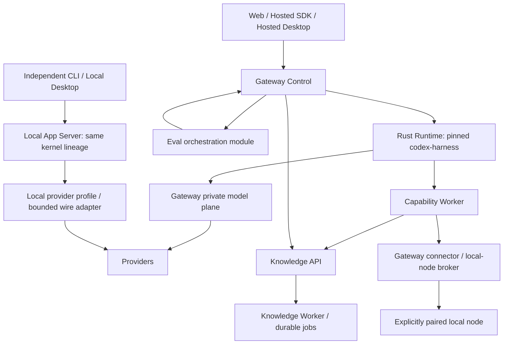
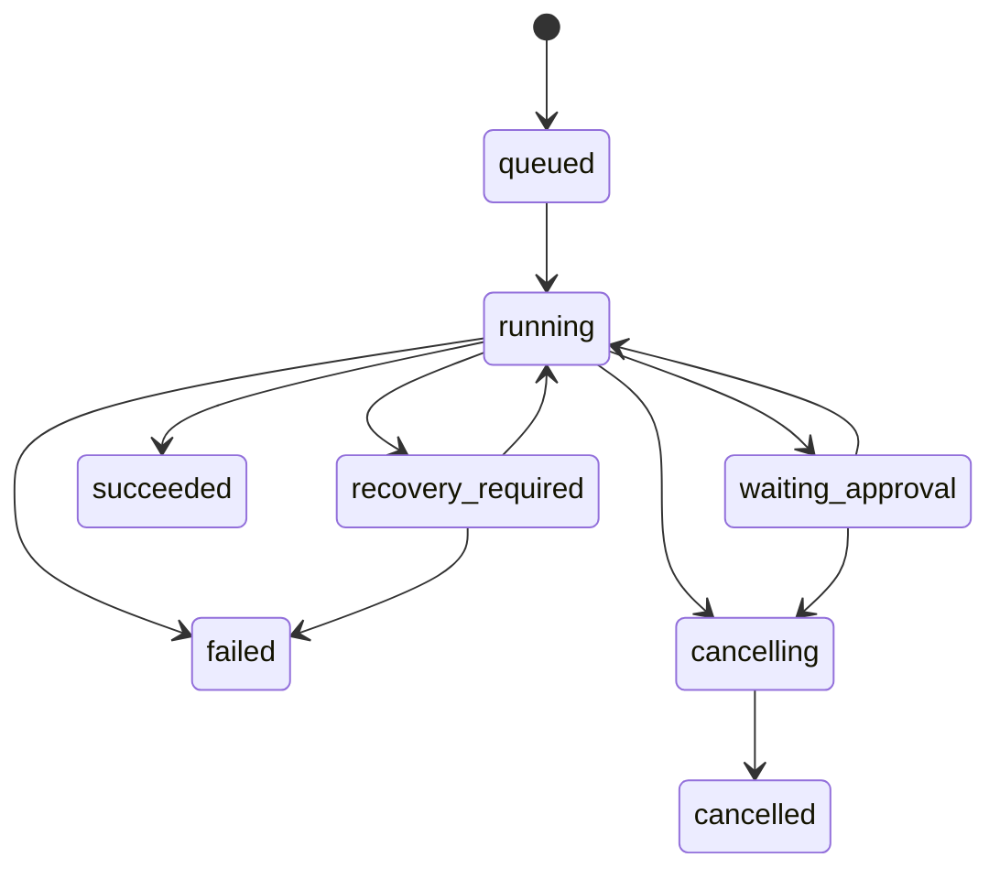

# 02 目标架构、所有权与兼容契约

status: queued · domain_id: agent-platform-vnext · owner: primary Codex · last_verified: 2026-09-07 · prerequisite: 主 PRD 激活 · successor: null

本文的新增字段与目录均为目标设计。现有路由、schema version 与 DB 函数在冻结前保持有效。与 accepted ADR 的冲突必须由精确的 successor ADR 解决，不能在代码中静默改写。

## 1. 保留部署边界，收敛内部模块

图中的 Eval/Model Plane 是 Gateway 内模块；不是新增服务。Eval 通过真实公共 Agent 边界执行候选，但不能借固定 admin token 模拟任意租户。Local App Server 与 Hosted Runtime 是不同部署身份下的同源内核，不在一个 Run 中嵌套两个模型循环。

### 1.1 代码组织目标

| 区域 | 保留位置与建议内部切分 | 禁止 |
| --- | --- | --- |
| Gateway HTTP | `src/api/`：认证依赖、schema、状态码、流转接；调用 application service | API 文件承担领域事务或被 service 反向 import |
| Gateway model control | `src/services/llm/` 增量形成 catalog / capability-profiles / routing / policy / cost ports | adapter 各自选择凭证、预算和隐藏 fallback |
| Runtime compatibility | 现有 `src/services/agent_runtime/{control,model}/` 与 `assistant_entry` | 重回 Python AgentLoop；在 model plane 发起新 turn |
| Agent catalog / Eval | 先把现有 core 中的具体 repository/service 分别迁到其 Gateway owner；纯协议进入 contracts | 新增跨领域 mega-repository、通用 BaseService 或把同一代码复制到两个包 |
| Knowledge | 现有 `services/knowledge` 内分 ingestion / parsing / indexing / retrieval / lifecycle；persistence 按聚合拆 | 一次变更同时移动路径、改变检索算法和迁移权限 |
| Contracts | 复用 `packages/ai-gateway-contracts`、Rust capability contract、现有 SDK fixtures | 复制三套独立校验常量；contracts 建立 DB/HTTP/client 实例 |
| Web / 客户端 | 复用 `web/src/features/chat` reducer/terminal latch；提取最小客户端协议包时先生成契约 | 把 React 组件、密钥管理、服务调用、状态机全装进 shared 包 |
| 本地设备 | `apps/local-node` 的 grant / pairing / ledger / driver 边界保留 | 让任意 WebView 或远程 HTML 直接拥有 shell / filesystem 权限 |

目录调整优先围绕依赖/事务所有权，不按固定 LOC 切块。一个 300 行文件拥有多个权威仍是问题；一个上游 overlay 大文件若未触碰，不因行数触发本期重构。

## 2. 权威与持久对象所有权

| 对象 | 唯一写 owner | 允许消费 | 版本/隔离边界 |
| --- | --- | --- | --- |
| Tenant / user / role / credentials | Gateway identity / credential broker | 其他域使用已验证主体与短期 scoped grant | tenant、audience、expiry、revocation epoch |
| Agent draft / immutable version / publication | Gateway Agent catalog | Runtime/客户端只拿 resolved snapshot 或公开投影 | spec hash、policy hash、channel、版本 |
| Run / turn / item / approval lifecycle | Rust Runtime + 现有授权 DB 函数；Gateway ledger 是幂等投影/账本 | Gateway/客户端订阅投影 | run owner、thread sequence、fencing epoch |
| Model reservation / usage / settlement | Gateway model/usage owner | Runtime 使用无 provider secret 的 lease | call_id、attempt_id、budget reservation |
| Capability execution / effect ledger | Worker；一用 approval proof 由既有授权边界签发并校验 | Runtime 消费结果，Gateway 提供必要 broker | tool identity、input hash、approval scope、effect key |
| Dataset / document / parsed IR / index generation | Knowledge；迁移 owner 为统一 DB authority | Gateway 代理，Worker scoped retrieval | tenant、dataset、content/ACL/index revision |
| 通用 Eval suite / trial / judge result | Gateway Eval | 发布与路由模块读取已冻结证据 | suite hash、candidate fingerprint、judge version |
| RAG golden set / release pointer | Knowledge 的既有 `kb_eval_golden_store` | Gateway Eval通过版本化合同引用，不直接写Knowledge表 | golden manifest、dataset/index revision、review provenance |
| Artifact bytes / metadata | 当前 artifact owner 的 broker 与 worker 协调；明确每种 kind | 经鉴权下载、引用、过期清理 | tenant、run、digest、retention、origin |
| Local thread / provider profile / OS grant | 本地 App Server / local shell broker | 本地 UI；明确授权后导出或远程连接 | local profile/device/workspace；不冒充 hosted tenant |

DB role 已实现不等于最小权限完成。角色矩阵必须落到表/列/函数/sequence；Knowledge 不应写 `gateway.users`，也不应为删除确认读取密码 hash。跨域需要 step-up confirmation token 时由 Gateway 验证，Knowledge 接收短期绑定对象/动作的证明。

## 3. C-01 主体与策略契约

**目标内部类型 `ExecutionSubjectV1`**：`subject_id, subject_kind(user/service/device), tenant_id, actor_id, auth_method, audience, scopes, policy_revision, credential_ref`。`credential_ref` 只在可信边界解析，不传给模型，不等于 secret value。公共 header 不得自行声明权威 tenant。

- Hosted 启动、Eval、后台定时任务、embed 和 local-node broker 必须解析同样的权威身份；使用代理身份时记录 actor/on_behalf_of 和授权链。
- 权限取交集：`tenant policy ∩ principal rights ∩ Agent policy ∩ channel restrictions ∩ current resource ACL ∩ per-action approval`。deny 优先；未知效果默认受限。
- 资源撤权优先于可复现性：snapshot 固定的是配置，不是永久访问权。执行前/读取前校验当前 ACL revision；撤权后 fail closed 并记录原因。
- 无 tenant 的 standalone Local 用独立 subject_kind/profile，不填伪 tenant，也不接受 hosted 内部 token。
- 验收：A token 执行 B eval job、同名 role 跨 tenant、旧 approval、撤销 dataset、embed 扩权均在调用/副作用前拒绝。

## 4. C-02 AgentSpec 与 resolved launch

现有 `AgentSpec v1` 与 `ResolvedAgentLaunchV1` 已存在，四类入口已有统一 resolver。**目标是把缺失的产品策略统一进去，不新建平行 launch 权威。**

目标下一个 AgentSpec 版本增加/规范：

| 字段 | 语义 | 迁移规则 |
| --- | --- | --- |
| `execution.mode` | primary/subagent 的产品语义，映射到上游已有执行能力 | v1 保持现有默认；不透传 provider 专有概念 |
| `permissions` | tools/resources/network/filesystem/data ruleset | 显式空/缺省不同；v1 迁移为等价已解析边界，不能扩大 |
| `budget` | tokens/cost/deadline/steps/tool_calls/children 上限 | server ceilings 取最小值；未知费用仍受保留上限 |
| `delegation` | 可委派类型、深度、并发、预算分配 | child 不可比 parent 权限更大；取消级联 |
| `knowledge` | dataset binding + retrieval profile version + 可选 index pin | profile/config hash 明确；不得只有自由文本说明 |
| `memory` | off/session/persistent、scope、TTL、capture policy | 默认不得增加未声明的长期保存 |
| `output_contract` | text/schema/artifact kinds + 验收结构 | 不等于让 LLM 自评完成 |

Resolved launch 固定 `Agent version, model/profile, tool schema, skills, knowledge/index selection, policy, budget, channel, runtime compatibility` 的 hash。一、二期首版路由只在launch前选择provider/model；同一已授权模型的重试继续使用现有reservation规则。当前签名lease固定provider/model，单独创建新reservation不授权换模型。运行中跨模型fallback属于GW-08的后续合同：显式创建新的授权snapshot/lease/attempt并关联原run，旧snapshot不可变；未授权候选拒绝，旧attempt的unknown结果先协调。禁止通过放松当前model/lease一致性校验实现fallback。

发布前 diff 要展示实际权限/模型/知识变化；preview、published、assistant、Responses 相同有效配置必须得到相同语义指纹。允许入口专有展示字段，不允许隐藏权限差异。

## 5. C-03 工具与 provider wire 兼容

工具规范身份是 `(namespace, name, schema_version/schema_hash)`。wire alias 是 transport 编码，不是新的逻辑身份。Gateway 与独立 CLI 共用规范化 fixture：同名不同 namespace、provider 截断/改名、stream 参数分片、历史回放、恢复均可验证。

`provider_supports(tool)`、`agent_may_use(tool)`、`user_selected(tool)` 三项都满足才可出站。`tool_choice=none` 在所有 round 中稳定；历史 tool transcript 只说明已发生的事实。仅一次 `required` 的约束完成后可按合同降为 auto；parallel_tool_calls 的授权约束不得被历史记录重置。

能力矩阵必须有：Responses / Chat Completions、text、function tools、namespaces、parallel calls、structured outputs、image input、native search、usage、reasoning metadata、resume semantics。每项状态为 supported / unsupported / unverified，附具体 provider/profile 版本。独立CLI继续遵守ADR-009的无损可表示子集；工具身份、参数、审批和终态没有“用户勾选即可有损转换”的例外。

不可无损表示时，返回稳定错误并禁用对应 UI 入口。不能发送出去后忽略未知 event/tool，再输出 completed。所有 adapter 共享以下终态/背压合同，但不强行把 provider 差异抹平。

## 6. C-04 Run 与事件终态

保留现有 `/api/v2/agent/threads` 与 turn/events/approval 路由。建议版本化增强字段，不擅自重命名既有 event types。

**目标事件 envelope 的最小语义**：`schema_version, event_id, thread_id, run_id, parent_run_id?, sequence, type, occurred_at, payload, trace_id`。sequence 是线程内持久 cursor，不是客户端时间戳；payload 中敏感内容按可见性投影。

这些状态是规范化产品语义；实现需映射现有状态而非直接替换 DB enum。`recovery_required` 表示执行归属/副作用需要协调，不是成功。

- 每个 run 恰有一个权威 terminal decision；网络上事件可以重送，消费方按 event_id/sequence 幂等。
- Whole-thread SSE 在每个根 run terminal 时更新对应 Gateway ledger/lease，继续订阅未来 turn；per-turn SSE 只在目标 run terminal 后结束。
- 列表、恢复、订阅共享 durable cursor；超过一页、断流、尾部 terminal、child event 都可回放。不能用 100ms idle timeout 代替持久层终态。
- UI composer lock 由运行状态推导，不能因为一次网络异常永久锁死；显示重连/需恢复/等待审批，并可重新获取快照。
- 服务端工作与浏览器连接解耦。关闭客户端是否取消 run 由显式请求合同决定；取消意味着停止后续工具、通知 worker，并等资源回收后释放执行槽。
- 有界缓冲：frame、总文本、reasoning metadata、单/总工具参数、事件数、输出队列都有预算；慢消费者触发背压或可恢复断流，不能无限缓存。

## 7. C-05 副作用与后台任务

不承诺一般外部 API 的端到端 exactly-once。目标是**幂等调用 + fenced owner + 明确 unknown outcome + 对账**。

模型 call：`reserved → dispatched → succeeded/failed/unknown`。工具 execution：`published → authorized → dispatched → succeeded/failed/cancelled/unknown`。后台 job：`queued → claimed → running → terminal/retry_wait/dead_letter`。

共同要求：

1. Idempotency key scope 包含 tenant、operation 和 canonical input hash；相同 key 不同输入拒绝。
2. owner_id + lease_until + claim_token/fencing_epoch；旧 worker 在失去 lease 后不得 publish/settle。
3. 原子 claim，续租，有限 retry/backoff，最大 deadline；取消与 lease 丢失传到底层进程组。
4. 一次 claim 多个 job 不能让尚未执行的 job 永久 running；可按执行槽 claim，或租约覆盖全部已领取项并能 reclaim。
5. outbound 写请求失联不能假定失败再重放；查询外部幂等结果或进入人工/自动对账状态。
6. stdout/stderr/log/artifact 独立限制；inputs 与 outputs 隔离，符号链接/设备/路径逃逸拒绝，总字节和 inode 在执行中受硬限制。
7. durable job 列表提供阶段、完成量、心跳、重试次数、失败原因、取消和恢复；不要把后台任务包在长 HTTP 中。

容量分为run槽、provider-call槽、capability槽、后台job槽和SSE连接槽。它们是不同资源，使用同一admission组件不等于同一个semaphore。入口持有run槽时，内部model callback领取provider-call槽；同一逻辑调用跨适配器转接不重复领取同维度额度。采用固定的资源领取顺序和deadline，不能持有更细资源反向等待父资源。必测全局run容量1、provider容量1下一个Agent正常完成多轮调用，避免目标架构引入自我阻塞。

## 8. C-06 路由与计量

**目标 `RoutePolicyVersion`** 固定候选、约束、选择规则及回退规则；**目标 `RouteDecision`** 记录 policy hash、candidate set、排除理由、选中 model/provider、能力版本、估算/保留预算、trace、实验 cohort、attempt。

先硬过滤（tenant、能力、地域/数据政策、context、预算），再按确定性优先级/权重选择。成本/延迟/质量优化只在合格集合中运行。语义缓存默认关闭，仅对明确纯读、可共享语义、严格 scoped 的场景实验；不得缓存带副作用的 Agent turn。

Gateway 保留策略与凭证所有权。Hosted Runtime 按已有新 reservation 机制发起重试；model plane 不在已 dispatched 请求后暗自跨 provider 重试。传统 proxy 的 retry 与 Agent model attempt 必须分别声明，禁止乘法式重试。

费用使用整数微单位与币种，记录 price_version、provider usage、estimated/actual/unknown；缓存读写与 reasoning token 不重复计费。超预算、usage 缺失、重复 terminal、超时未知结算必须可对账。

## 9. C-07 知识版本与检索

目标 `KnowledgeSnapshot`：`tenant, dataset_id, content_revision, acl_revision, parser_revision, chunker_revision, embedding_identity, lexical_identity, index_generation, retrieval_profile_revision`。

目标检索输入：已授权 subject、query、snapshot/profile、deadline、candidate limits、trace context。输出：chunks、来源定位、各阶段原始/归一化/融合/重排分数及语义、effective config、degradation reason、timing、index/ACL revision。分数不能冒充答案正确概率。

- ACL 在缓存查找前生效；缓存 key 包含 tenant、授权等价域/ACL revision、数据/索引/配置/模型版本。撤权与删除栅栏立即阻止旧缓存结果。
- pin必须对应真实可读的内容/索引物理版本；稳定ID的upsert不是历史版本能力。尚无历史版本或已按保留政策GC时返回`snapshot_unavailable`，禁止悄悄读取最新版。活跃pin、最长保留期、存储预算和GC引用计数必须登记；撤权/法定删除优先，不因pin保留可访问副本。
- IR 必须来自真实页/block producer，保留页码/bbox/reading order/parser receipt；“全部文本装进 page 1”不能算页级解析完成。
- 普通上传/文档重处理：构建candidate generation → 完整性/安全/绑定一致性校验 → 持久publish intent → 切binding → reader fencing → finalize。新空库不被强制要求先拥有人工黄金集。
- embedding模型、parser/chunker默认策略、检索策略的晋升：在上述完整性门槛之外，必须跑冻结query相关性质量gate；结构自检不能替代语义质量。失败有reconciliation和旧代保留。
- 数据删除：先 tombstone/deny reads，再持久清理所有 index/object generations，最后确认终态；断网不恢复可见性。审计保留与隐私删除按对象分类，不能保留可重新检索的内容副本。
- 运行中 pin 遇撤权/删除必须停止访问；可复现不能凌驾访问控制。

## 10. C-08 Eval 与证据

目标 `CandidateFingerprint` 固定 code/image/schema、Agent/spec/prompt/tools/policy、model/provider/profile、sampling、KB content/index/config、环境与 seed/试次；模型 provider 不支持 seed 时显式记录。

目标 `TrialReceipt` 记录 task_id/trial_id、authoritative tenant、候选指纹、原始可允许输出/工具事件、外部环境 outcome、终态、成本/延迟、grader 版本、失败/skip/infra_error 分类。结果与证据保留遵守访问与脱敏策略，不收集隐藏 chain-of-thought。

Eval 调用真实被评候选入口；judge 使用不同权限、不能执行被评 Agent 工具。对任务完成的判定优先来自外部 outcome oracle；LLM judge 只补充语义质量，并定期以真实人工标签校准。评测生成器不能自行批准黄金集。

## 11. C-09 客户端与桌面

Local/Hosted workspace 选择必须在会话创建前明确，切换时保留隔离的历史/凭证/工具授权。文件到远端、会话导出/导入、远端调用本机工具都是单独的授权边界。

桌面 UI 通过 local App Server 适配器或 Gateway public API；不直接使用 Runtime 私有 HTTP。Tauri 只承担 window/IPC/OS credential store/文件选择/通知/sidecar 生命周期；不实现第三套 Agent loop。远程 HTML、消息内容、插件输出在无原生权限的渲染隔离环境展示。

CLI 保留交互与 headless、stdin/stdout/stderr、稳定退出码、signal、resume、config/profile、doctor 和离线自诊断；退出码与终态、实际 outcome 一致。机器模式 stdout 只输出协议，日志进入 stderr，密码永不进入 argv。

## 12. 迁移与回滚约束

| 改动 | 默认迁移策略 | 回滚证明 |
| --- | --- | --- |
| AgentSpec/launch/event 增加字段 | 显式 version、兼容 reader、旧版本默认等价映射、contract fixture | N-1 client 读新事件；新 client 读旧服务；旧 run 可继续 |
| repository owner 搬迁 | 先冻结导出/事务，纯移动，再收缩 shim，最后改行为 | 原始成功/失败路径一致，依赖边界门禁 |
| DB role 收缩 | 新权限矩阵、负向测试、canary，再撤过宽 grant | 精确恢复授权能力，不能临时切 superuser |
| Dataset ACL role资格修复 | 旧role grant按dataset owner tenant回填；含糊主体拒绝或隔离；显式user/public共享独立维持已声明语义 | N-1必须带安全修复或使用拒绝旧reader的版本栅栏；不能回滚到裸role跨tenant放行 |
| job/lease 改造 | 新字段可空→回填→claim双读→切写；旧running row显式收养 | kill/restart/reclaim 与旧 worker 防重入 |
| 索引/embedding | 新 generation shadow、固定语料验证、原子 binding/持久协调 | 保留旧 collection 与模型身份；在 ACL/删除栅栏下回切 |
| native / Runtime + Worker | release unit 锁 code+overlay+image digests+platform+protocol | current→frozen→current，实际任务、历史与副作用账本均验证 |
| 桌面/CLI profile 与本地 state | 备份格式版本，原子写，失败保留原件；秘密用 OS store | 上一版本恢复并可打开旧任务；不删用户文件 |

DB 不可逆迁移归 `restore-required`，不能用“回退镜像”冒充数据回滚。现有 migration 101 的 dump/restore 边界继续有效。没有冻结旧镜像、备份、旧语义读取证据时，正式发布保持未满足。

## 13. 给实现者的接口与字段细则

### 13.1 目标规范类型

这些是语义类型提案，优先映射到已有模型，不要求另造同名runtime类。公共字段不能包含credential ref/secret；内部subject类型与public launch分开。

| 类型 | 必需字段/类型 | 校验与兼容要求 |
| --- | --- | --- |
| `ModelRef` | `provider_id: string`, `model_id: string`, `capability_revision: string`；tenant来自权威context | 不接受只改header的tenant；省略provider的旧别名冻结成明确映射。新歧义拒绝并列候选，不能按动态sort_order换provider |
| `BudgetPolicy` | `max_input_tokens/max_output_tokens/max_tool_calls/max_steps/max_children: nonnegative integer`, `max_cost_microunits: integer`, `currency: string`, `deadline_ms: positive integer` | 不接受NaN/Infinity/负数；0是否禁用按字段定义；null表示继承，不能表示无限；tenant ceiling取最小值 |
| `PolicyVersionRef` | `id: string`, `version: immutable integer/string`, `sha256: string` | 更新产生新version；publish指针CAS；传入hash不匹配直接拒绝 |
| `RouteDecision` | `decision_id`, `policy_ref`, `model_ref`, `eligible_candidates`, `excluded_reasons`, `attempt_id`, `budget_reservation_id`, `trace_id` | 不包含credential/原始秘密；随机weighted策略记录selection seed或可复现抽样receipt；实际选择不是只存预期model |
| `OperationSnapshot` | `operation_id`, `kind`, `state`, `stage`, `completed`, `total?`, `attempt`, `heartbeat_at?`, `cancel_requested`, `error?` | completed≤total；未知total为null不是0；保留既有KB operation类型/ID，不跨tenant暴露claim token |
| `MetricObservation` | `value: number or null`, `unit`, `window_start/end`, `sample_count`, `source`, `data_status`, `observed_at` | n=0则率为null；collection_error与no_data不同；readiness不伪装成功率 |
| `KnowledgeVersionRef` | dataset/content/ACL/index/parser/chunker/embed/profile版本及物理generation引用 | pin仅对可读物理版本有效；缺失/GC/撤权分别给typed error；普通latest选择也记录实际版本 |
| `TrialResult` | `task_id`, `trial_id`, `candidate_fingerprint`, `execution_status`, `outcome_status`, `scores[]`, `usage?`, `timing`, `evidence_refs[]` | 未评分score为空/invalid，不是0；未知usage为null；每score有grader/version和量纲 |

所有ID长度/字符规则复用现有contracts；新字段必须闭合校验且向后兼容reader有显式扩展策略。涉及费用使用整数微单位和币种；不得用浮点近似作为账本权威。客户端不可自行写authoritative tenant、claim owner、价格或actual provider。

### 13.2 API目录与操作语义

| 对象 | 当前/目标入口 | 语义要求 |
| --- | --- | --- |
| Thread/Turn/Event/Approval | 当前`/api/v2/agent/threads`及子路由 | 保留既有cursor/状态码；schema协商以兼容增强实现，旧SSE consumer的未知optional事件可忽略，未知terminal不能伪成功 |
| KB批量操作 | 当前`/api/v1/knowledge/{dataset_id}/documents/batch-reindex`、`batch-delete`和`document-batches/{operation_id}` | 复用202+operation查询；新增Dataset delete/dedupe扩展同一operation合同，不冒用文档ID或另建队列 |
| RoutePolicy版本 | **目标**`/api/v1/routing/policies/{id}/versions` | POST创建不可变版本，GET读取；mutation需idempotency key与revision条件；不直接生效 |
| Routing dry-run | **目标**`/api/v1/routing/policies/{id}/simulate` | 仅解析/解释，不向provider发请求、不预占真实账本、不运行工具；有完整权限过滤 |
| Routing publish | **目标**`/api/v1/routing/policies/{id}/publish` | 指定version+expected current+gate receipt，CAS切换；并发发布冲突409；回滚也是新审计记录 |
| Routing decision详情 | **目标**`/api/v1/routing/decisions/{id}` | 只读tenant-scoped，脱敏候选/理由/实际成本关联；不含provider秘密 |
| Eval suite/trial/comparison | 当前Eval API增量版本化 | 保留既有ID与RAG黄金集owner，新增fingerprint/invalid状态；不能统一成Gateway写KS表 |
| Client/local IPC | Local App Server现有协议+薄产品适配；Hosted public API | 先协商版本/能力，再建立任务；loopback绑定/nonce或等价认证；浏览器公开Origin不代表本地权限 |

新API路径只是目标命名，P2-02先检查是否已有等价入口；若复用旧入口，更新这张目录和contract-delta，不保留两个独立管理权威。所有公开新增入口必须进入OpenAPI与SDK变更测试。

### 13.3 错误、重试与并发

错误投影的目标字段：`code, message_safe, phase, retryable, request_id, run_id?, operation_id?, retry_after_ms?`；原provider payload/内部栈和秘密留在受控日志，不返回用户。目标语义映射：

| 情况 | HTTP/事件语义 |
| --- | --- |
| 未认证/无权访问 | 401/403或当前统一的隐藏资源404；保持各入口既有合同与隐私策略 |
| 格式/不支持能力 | 422 +稳定code；在provider/worker dispatch前拒绝 |
| stale revision / 幂等key换输入 / model alias歧义 | 409；允许用户重新解析，不能自动覆盖 |
| 资源/配额不足 | 429或当前quota合同；说明scope/可重试时刻，不泄漏其他租户负载 |
| 已授权snapshot已GC | 410 + `snapshot_unavailable`；未知/无权资源遵守隐藏404规则；绝不降级latest |
| job已接受 | 202 +operation location；HTTP断开不撤销job |
| dispatched后结果未知 | run/call/tool typed unknown/recovery_required；流不能completed；对账前不盲重放 |
| provider暂时失败 | typed failed +安全retryability；Runtime新reservation与普通proxy重试权限分别判断 |

模型输出不参与错误代码、资源释放、审批决定和成功账态判定。并发mutation使用If-Match或请求中的expected_revision之一统一实现，不能两套互相绕过。幂等scope包含actor/tenant/operation/body hash，保留期覆盖可重试窗口，并记录到期后的语义。

### 13.4 流预算的初始建议

CP-04/CL-02执行前冻结现有合法最大输出并选择默认。建议起点：单SSE frame 1MiB、单tool args 1MiB、总text与tool args各8MiB、100000事件、待发送队列2MiB；stderr/log另限256KiB。单位按UTF-8字节，增量decoder跨chunk有效；压缩/解压与HTTP body也受限。

这些数值是可调整设计预算，不是当前限制。以合法长任务与恶意边界双测后定稿；server/tenant可以收窄，普通调用不能扩大。超限abort upstream并唯一failed；慢消费者先backpressure，无法继续时保留durable cursor后明确断流，不假装成功。真实运行内存必须包含解析对象/字符串副本开销，不能只数网络字节。
