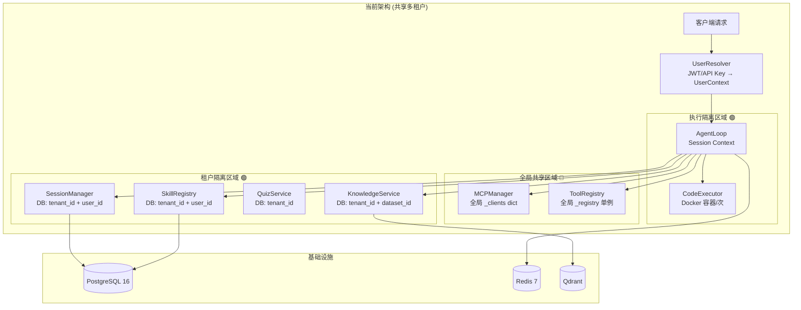
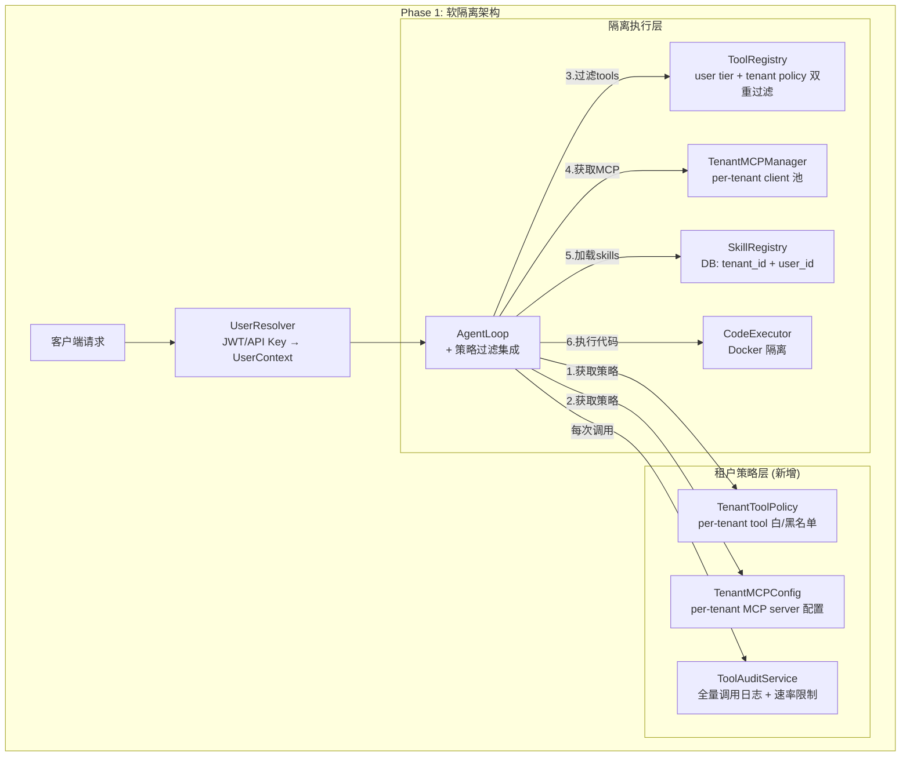

# ADR-002: AI Agent 用户隔离与沙箱架构设计

**状态:** 已提议 (Proposed)
**日期:** 2026-04-02
**决策者:** Hejaz Financial Services AI Platform Team
**技术领域:** 安全隔离、沙箱、多租户架构

---

## 摘要

本 ADR 评估 AI Gateway 平台的用户隔离现状，对比业界主流沙箱方案，并提出分三阶段实施的隔离架构：Phase 1 软隔离（代码层面）、Phase 2 虚拟容器沙箱（自建）、Phase 3 桌面端 Agent。目标是在不引入第三方 SaaS 依赖的前提下，为 Halamony（金融理财）和 Wahda（社交语聊）两个核心 App 提供生产级的 AI Agent 隔离能力。

---

## 目录

1. [第一部分：架构对比矩阵](#第一部分架构对比矩阵)
2. [第二部分：现状审计](#第二部分现状审计)
3. [第三部分：Phase 1 — 软隔离](#第三部分phase-1--软隔离)
4. [第四部分：Phase 2 — 自建虚拟容器](#第四部分phase-2--自建虚拟容器)
5. [第五部分：Phase 3 — 桌面端 Agent](#第五部分phase-3--桌面端-agent)
6. [第六部分：实施路线图](#第六部分实施路线图)
7. [第七部分：对 Hejaz 业务场景的影响](#第七部分对-hejaz-业务场景的影响)
8. [参考链接](#参考链接)

---

## 第一部分：架构对比矩阵

### 1.1 Web 端沙箱方案对比

| 维度 | Manus AI (E2B) | Kimi OK Computer | Docker + gVisor | Firecracker (自建) | Kata Containers | Sysbox |
|------|----------------|-------------------|-----------------|-------------------|-----------------|--------|
| **隔离级别** | microVM (Firecracker) | 容器级 + workspace | gVisor 用户空间内核 | microVM (KVM) | VM (QEMU/Cloud Hypervisor) | 用户命名空间 |
| **启动延迟** | ~150ms (E2B托管) | ~500ms | ~200ms (增量) | ≤125ms (裸启动), ~28ms (快照) | 1-3s (VM启动) | ~100ms |
| **每实例内存** | ~128MB (含guest OS) | ~256MB (含工具链) | ~15-30MB (gVisor sentry) | <5MB (VMM) + guest OS | ~64-128MB (含guest) | ~10MB (增量) |
| **内核共享** | 否 (独立guest kernel) | 是 (共享宿主) | 否 (用户空间内核) | 否 (独立kernel) | 否 (独立kernel) | 是 (共享宿主) |
| **网络隔离** | 完全隔离 | 部分隔离 | 可配置 | 完全隔离 | 完全隔离 | 可配置 |
| **文件系统隔离** | 完全隔离 | workspace 隔离 | overlay + tmpfs | 完全隔离 | 完全隔离 | user-ns 隔离 |
| **适用场景** | Web SaaS | Web SaaS | Web SaaS / 开发 | Web SaaS / 高安全 | K8s 多租户 | 开发者工具 / CI |
| **成本模型** | SaaS ($0.09/hr) | 内部系统 | 自建 (免费) | 自建 (免费) | 自建 (免费) | 自建 (免费) |
| **运维复杂度** | 低 (托管) | 高 | 低 (替换runtime) | 高 (需自建编排) | 中-高 | 低-中 |
| **GPU 支持** | 否 | 未知 | 有限 | 否 (无PCIe) | QEMU支持 | 是 |

### 1.2 桌面端 Agent 方案对比

| 维度 | Claude Desktop | Claude Code | OpenClaw | Cursor/Windsurf |
|------|---------------|-------------|----------|-----------------|
| **隔离级别** | 进程级 + 权限对话框 | 进程级 + hooks | 进程级 | workspace 级 |
| **文件系统访问** | MCP server 代理 | 直接访问 | tool dispatch | workspace 限定 |
| **配置方式** | claude_desktop_config.json | CLAUDE.md + hooks | 自定义 config | IDE 设置 |
| **MCP 管理** | 声明式配置 | 运行时连接 | ClawHub skills | 内置插件 |
| **安全模型** | User Trust + Permission | User Trust + Approval | User Trust | Workspace Scoped |
| **可扩展性** | MCP 协议 | MCP + hooks + skills | Skills + Tools | 扩展市场 |
| **适用场景** | 普通用户桌面 | 开发者终端 | 高级用户 | IDE 开发 |
| **开源** | 否 | 是 (Agent SDK) | 部分 | 否 |

### 1.3 架构图：隔离级别对比

```
安全隔离强度 ↑
│
│  ┌──────────────────┐
│  │  Firecracker      │ ← 独立内核 + 独立设备 + KVM 硬件隔离
│  │  microVM          │   启动: ≤125ms, 内存: <5MB VMM
│  └──────────────────┘
│  ┌──────────────────┐
│  │  Kata Containers  │ ← 独立内核 + QEMU/CH 虚拟化
│  │  (VM-based)       │   启动: 1-3s, 内存: 64-128MB
│  └──────────────────┘
│  ┌──────────────────┐
│  │  gVisor (runsc)   │ ← 用户空间内核, 系统调用拦截
│  │                   │   启动: ~200ms, 内存: 15-30MB
│  └──────────────────┘
│  ┌──────────────────┐
│  │  Sysbox           │ ← 增强 user-namespace, 共享宿主内核
│  │                   │   启动: ~100ms, 内存: ~10MB
│  └──────────────────┘
│  ┌──────────────────┐
│  │  Docker (runc)    │ ← cgroups + namespaces, 共享宿主内核
│  │  ← 我们当前位置    │   启动: ~50ms, 内存: 最小
│  └──────────────────┘
│  ┌──────────────────┐
│  │  进程级隔离        │ ← 纯代码层面 tenant_id/user_id 过滤
│  │  (软隔离)         │   启动: 0ms, 内存: 0
│  └──────────────────┘
└─────────────────────────────→ 性能/资源效率
```

---

## 第二部分：现状审计

### 2.1 代码库安全隔离审计

基于对 `ai-gateway` 代码库的逐文件审计，以下是各组件的隔离状态：

| 组件 | 文件路径 | 当前隔离方式 | 风险等级 | 详细说明 |
|------|---------|-------------|---------|---------|
| **SkillRegistry** | `src/services/assistant/openclaw/skills/registry.py` | DB 级 tenant_id + user_id 过滤 | 🟢 低 | `load_from_database(tenant_id, user_id)` 支持每租户/用户加载；`user_id='*'` 表示租户级共享 |
| **MCPManager** | `src/services/assistant/mcp/manager.py` | ⚠️ 全局单例，无租户隔离 | 🔴 高 | `_clients` 字典全局共享；所有 MCP tools 注册到全局 `tool_registry`；无 tenant_id 过滤 |
| **ToolRegistry** | `src/services/assistant/tools/tool_registry.py` | 全局单例 + user tier/role 过滤 | 🟡 中 | `_registry` 全局变量；`list_tools(user=)` 按 tier 层级过滤；但无 tenant 级别隔离 |
| **Code Executor** | `src/services/assistant/code_executor.py` | Docker 容器 + 资源限制 | 🟢 低 | 每次执行独立容器；512MB 内存 / 0.5 CPU / 30s 超时 / 网络禁用；自动清理 |
| **Agent Loop** | `src/services/assistant/agent/agent_loop.py` | Session + tenant/user 上下文传播 | 🟢 低 | `AgentLoopContext` 包含 tenant_id/user_id；TaskManager 提供 session 隔离 |
| **Session/Memory** | `src/persistence/database.py` | DB 级 tenant_id + user_id 索引 | 🟢 低 | sessions 表按 (user_id, tenant_id, status) 索引；所有查询包含 tenant/user 过滤 |
| **KB 知识库** | `src/services/knowledge/knowledge_service.py` | DB 级 tenant_id + dataset 隔离 | 🟢 低 | datasets/documents/segments 均有 tenant_id 列；Qdrant 按 dataset 分 collection |
| **文件存储** | `src/services/storage/file_storage.py` | user_id 路径前缀 + 随机文件名 | 🟡 中 | 路径格式 `uploads/{user_id}/{file_id}_{timestamp}`；缺少 tenant_id 前缀层；file_id 为 8 位 hex (可枚举风险较低) |
| **Quiz/Exam** | `src/services/assistant/quiz/quiz_service.py` | DB 级 tenant_id + 创建者/参与者区分 | 🟢 低 | quizzes 按 tenant 隔离；attempts 按 user 隔离；creator 可见所有 attempts |

### 2.2 关键发现

**🔴 高风险 — 需立即修复：**

1. **MCPManager 无租户隔离** — 这是最严重的问题。所有租户共享同一组 MCP clients 和 tools。攻击向量：租户 A 可以调用本应仅对租户 B 可见的 MCP 工具。

**🟡 中风险 — 应在 Phase 1 解决：**

2. **ToolRegistry 缺少租户级别过滤** — 虽有 user tier/role 过滤，但同一 tier 下不同租户的用户可看到相同 tools。对于多租户 SaaS 场景，这不够安全。

3. **文件存储路径缺少 tenant_id** — 当前路径 `uploads/{user_id}/...` 假设 user_id 全局唯一。如果不同租户使用相同身份提供商，user_id 可能冲突。

### 2.3 现状架构图



---

## 第三部分：Phase 1 — 软隔离

**目标：** 纯代码层面实现租户/用户隔离，不需要新的基础设施组件。
**工期：** 2-3 周
**复杂度：** 中
**风险：** 低

### 3.1 ToolRegistry 权限过滤增强

**当前问题：** `list_tools()` 仅按 user tier/role 过滤，不按 tenant 过滤。

**方案：** 引入 `TenantToolPolicy`，在 agent_loop 里按 tenant 配置过滤可用 tools。

```python
# src/services/assistant/tools/tenant_tool_policy.py

from dataclasses import dataclass, field
from typing import Optional

@dataclass
class TenantToolPolicy:
    """每个租户的 Tool 访问策略"""
    tenant_id: str
    allowed_tools: set[str] = field(default_factory=set)      # 白名单 (空=全部允许)
    blocked_tools: set[str] = field(default_factory=set)      # 黑名单
    allowed_categories: set[str] = field(default_factory=set)  # 允许的 tool 类别
    max_tool_calls_per_session: int = 100                      # 每 session 最大调用数
    max_tool_calls_per_minute: int = 20                        # 速率限制

class TenantToolPolicyService:
    """从数据库加载租户 Tool 策略"""

    def __init__(self, database):
        self.database = database
        self._cache: dict[str, TenantToolPolicy] = {}

    async def get_policy(self, tenant_id: str) -> TenantToolPolicy:
        if tenant_id in self._cache:
            return self._cache[tenant_id]

        row = await self.database.fetchrow(
            "SELECT * FROM tenant_tool_policies WHERE tenant_id = $1",
            tenant_id
        )
        if row:
            policy = TenantToolPolicy(
                tenant_id=tenant_id,
                allowed_tools=set(row['allowed_tools'] or []),
                blocked_tools=set(row['blocked_tools'] or []),
                allowed_categories=set(row['allowed_categories'] or []),
                max_tool_calls_per_session=row.get('max_calls_per_session', 100),
                max_tool_calls_per_minute=row.get('max_calls_per_minute', 20),
            )
        else:
            policy = TenantToolPolicy(tenant_id=tenant_id)  # 默认策略

        self._cache[tenant_id] = policy
        return policy

    def filter_tools(
        self, tools: list, policy: TenantToolPolicy
    ) -> list:
        """按租户策略过滤 tools"""
        result = []
        for tool in tools:
            # 黑名单优先
            if tool.name in policy.blocked_tools:
                continue
            # 白名单检查 (空白名单=全部允许)
            if policy.allowed_tools and tool.name not in policy.allowed_tools:
                continue
            # 类别检查
            if policy.allowed_categories and tool.category not in policy.allowed_categories:
                continue
            result.append(tool)
        return result
```

**在 AgentLoop 中集成：**

```python
# agent_loop.py 修改
async def _get_available_tools(self, ctx: AgentLoopContext) -> list:
    user = UserContext(user_id=ctx.user_id, tenant_id=ctx.tenant_id, ...)

    # 1. 获取 user tier/role 过滤后的 tools
    all_tools = self.tool_registry.list_tools(user=user)

    # 2. 再按 tenant policy 过滤 (新增)
    policy = await self.tenant_tool_policy.get_policy(ctx.tenant_id)
    filtered_tools = self.tenant_tool_policy.filter_tools(all_tools, policy)

    return filtered_tools
```

### 3.2 MCPManager 租户隔离

**当前问题：** 全局 `_clients` 字典，所有租户共享所有 MCP 连接。

**方案：** 引入 per-tenant MCP 配置，MCPManager 按 tenant_id 管理 clients。

```python
# src/services/assistant/mcp/tenant_mcp_config.py

from dataclasses import dataclass

@dataclass
class TenantMCPConfig:
    """租户级 MCP Server 配置"""
    tenant_id: str
    allowed_servers: list[str]         # 该租户允许连接的 MCP server 名称
    server_overrides: dict = None      # 租户特定的 server 配置覆盖
    max_concurrent_connections: int = 5

class TenantMCPManager:
    """租户隔离的 MCP Manager"""

    def __init__(self, base_configs: list, database):
        self._base_configs = {c.name: c for c in base_configs}
        self._tenant_clients: dict[str, dict[str, 'MCPClient']] = {}
        self._database = database

    async def get_tenant_config(self, tenant_id: str) -> TenantMCPConfig:
        row = await self._database.fetchrow(
            "SELECT * FROM tenant_mcp_configs WHERE tenant_id = $1",
            tenant_id
        )
        if row:
            return TenantMCPConfig(
                tenant_id=tenant_id,
                allowed_servers=row['allowed_servers'] or [],
                server_overrides=row.get('server_overrides'),
                max_concurrent_connections=row.get('max_connections', 5),
            )
        # 默认: 允许所有公共 servers
        return TenantMCPConfig(
            tenant_id=tenant_id,
            allowed_servers=list(self._base_configs.keys()),
        )

    async def get_tools_for_tenant(self, tenant_id: str) -> list:
        """获取指定租户可用的 MCP tools"""
        config = await self.get_tenant_config(tenant_id)
        tools = []
        for server_name in config.allowed_servers:
            if server_name in self._base_configs:
                client = await self._get_or_create_client(tenant_id, server_name)
                server_tools = await client.list_tools()
                tools.extend(server_tools)
        return tools

    async def _get_or_create_client(self, tenant_id: str, server_name: str):
        key = f"{tenant_id}:{server_name}"
        if key not in self._tenant_clients.get(tenant_id, {}):
            if tenant_id not in self._tenant_clients:
                self._tenant_clients[tenant_id] = {}
            config = self._base_configs[server_name]
            client = MCPClient(config)
            await client.connect()
            self._tenant_clients[tenant_id][server_name] = client
        return self._tenant_clients[tenant_id][server_name]
```

### 3.3 Tool 调用审计日志

**方案：** 所有 tool/skill/mcp 调用写入审计日志表。

```python
# src/services/assistant/audit/tool_audit.py

import time
from dataclasses import dataclass
from typing import Optional

@dataclass
class ToolAuditEntry:
    tenant_id: str
    user_id: str
    session_id: str
    request_id: str
    tool_type: str        # "tool" | "skill" | "mcp"
    tool_name: str
    input_summary: str    # 截断的输入摘要 (不存完整数据)
    output_status: str    # "success" | "error" | "denied"
    error_message: Optional[str] = None
    latency_ms: float = 0
    timestamp: float = 0

class ToolAuditService:
    def __init__(self, database):
        self.database = database

    async def log(self, entry: ToolAuditEntry):
        await self.database.execute("""
            INSERT INTO tool_audit_log (
                tenant_id, user_id, session_id, request_id,
                tool_type, tool_name, input_summary,
                output_status, error_message, latency_ms, created_at
            ) VALUES ($1,$2,$3,$4,$5,$6,$7,$8,$9,$10, NOW())
        """, entry.tenant_id, entry.user_id, entry.session_id,
            entry.request_id, entry.tool_type, entry.tool_name,
            entry.input_summary[:500],  # 截断
            entry.output_status, entry.error_message, entry.latency_ms)

    async def check_rate_limit(
        self, tenant_id: str, user_id: str, limit_per_minute: int = 20
    ) -> bool:
        count = await self.database.fetchval("""
            SELECT COUNT(*) FROM tool_audit_log
            WHERE tenant_id = $1 AND user_id = $2
            AND created_at > NOW() - INTERVAL '1 minute'
        """, tenant_id, user_id)
        return count < limit_per_minute
```

### 3.4 数据库迁移清单

需要新增或修改的表：

```sql
-- 1. 新表: 租户 Tool 策略
CREATE TABLE tenant_tool_policies (
    id UUID PRIMARY KEY DEFAULT gen_random_uuid(),
    tenant_id VARCHAR(64) NOT NULL UNIQUE,
    allowed_tools TEXT[],           -- 白名单
    blocked_tools TEXT[],           -- 黑名单
    allowed_categories TEXT[],      -- 允许的类别
    max_calls_per_session INT DEFAULT 100,
    max_calls_per_minute INT DEFAULT 20,
    created_at TIMESTAMPTZ DEFAULT NOW(),
    updated_at TIMESTAMPTZ DEFAULT NOW()
);
CREATE INDEX idx_ttp_tenant ON tenant_tool_policies(tenant_id);

-- 2. 新表: 租户 MCP 配置
CREATE TABLE tenant_mcp_configs (
    id UUID PRIMARY KEY DEFAULT gen_random_uuid(),
    tenant_id VARCHAR(64) NOT NULL UNIQUE,
    allowed_servers TEXT[] NOT NULL,
    server_overrides JSONB,
    max_connections INT DEFAULT 5,
    created_at TIMESTAMPTZ DEFAULT NOW(),
    updated_at TIMESTAMPTZ DEFAULT NOW()
);
CREATE INDEX idx_tmc_tenant ON tenant_mcp_configs(tenant_id);

-- 3. 新表: Tool 调用审计日志
CREATE TABLE tool_audit_log (
    id BIGSERIAL PRIMARY KEY,
    tenant_id VARCHAR(64) NOT NULL,
    user_id VARCHAR(128) NOT NULL,
    session_id VARCHAR(128),
    request_id VARCHAR(128),
    tool_type VARCHAR(16) NOT NULL,   -- tool/skill/mcp
    tool_name VARCHAR(256) NOT NULL,
    input_summary TEXT,
    output_status VARCHAR(16) NOT NULL, -- success/error/denied
    error_message TEXT,
    latency_ms FLOAT,
    created_at TIMESTAMPTZ DEFAULT NOW()
);
CREATE INDEX idx_tal_tenant_user ON tool_audit_log(tenant_id, user_id);
CREATE INDEX idx_tal_created ON tool_audit_log(created_at);
-- 分区建议: 按月分区以控制表大小
-- 保留策略: 90 天自动清理

-- 4. 修改现有表: 文件存储路径加 tenant_id
-- artifacts 表已有 tenant_id，但存储路径需更新
-- 存储路径从 uploads/{user_id}/... 改为 uploads/{tenant_id}/{user_id}/...

-- 5. 新增索引: 确保所有查询路径都有 tenant_id
CREATE INDEX IF NOT EXISTS idx_sessions_tenant
    ON sessions(tenant_id, user_id, status);
CREATE INDEX IF NOT EXISTS idx_artifacts_tenant_user
    ON artifacts(tenant_id, user_id);
```

### 3.5 Phase 1 架构图



---

## 第四部分：Phase 2 — 自建虚拟容器

### 4.1 四种方案评估

#### 方案 A: Docker + gVisor (runsc)

**原理：** gVisor 是 Google 开发的用户空间内核，作为容器 runtime 替换 Docker 默认的 runc。它在用户空间实现了 Linux 内核的系统调用接口，拦截容器内的所有 syscalls 并在 Sentry 进程中处理，避免直接接触宿主内核。

**优势：**
- 改动最小：只需 `docker run --runtime=runsc`，现有 Docker Compose 基本不变
- 启动速度：与普通容器相当 (~200ms)
- 生产验证：Google Cloud Run、GKE Sandbox 已大规模使用；蚂蚁集团 70% 应用 <1% 开销
- 内存开销：gVisor Sentry 进程 ~15-30MB

**劣势：**
- syscall 密集型工作负载有性能开销（简单 syscall 2.2x 慢，文件 I/O 可达 216x）
- 网络密集型场景下降明显（ptrace 平台 -95%，KVM 平台 -56%）
- 部分 Linux syscalls 未实现（约 380/450 已支持）

**与 code_executor.py 集成：**

```python
# code_executor.py 修改 — 最小改动
class CodeExecutorService:
    async def execute(self, code: str, ...) -> CodeExecutionResult:
        # 只需修改 docker run 命令，添加 --runtime=runsc
        cmd = [
            "docker", "run",
            "--runtime=runsc",          # ← 唯一新增
            "--rm",
            "--network=none",
            f"--memory={self.config.memory_limit}",
            f"--cpus={self.config.cpu_limit}",
            f"--name=sandbox-{execution_id}",
            "-v", f"{workspace_dir}:/workspace:rw",
            self.config.docker_image,
            "python", "/workspace/main.py"
        ]
```

**安装步骤：**

```bash
# 在 Ubuntu 服务器上安装 gVisor
sudo apt-get update && sudo apt-get install -y apt-transport-https
curl -fsSL https://gvisor.dev/archive.key | sudo gpg --dearmor -o /usr/share/keyrings/gvisor-archive-keyring.gpg
echo "deb [arch=$(dpkg --print-architecture) signed-by=/usr/share/keyrings/gvisor-archive-keyring.gpg] https://storage.googleapis.com/gvisor/releases release main" | sudo tee /etc/apt/sources.list.d/gvisor.list > /dev/null
sudo apt-get update && sudo apt-get install -y runsc

# 配置 Docker 使用 gVisor
sudo runsc install
sudo systemctl restart docker

# 验证
docker run --runtime=runsc hello-world
```

#### 方案 B: Firecracker microVM (自建)

**原理：** Firecracker 是 AWS 开源的 microVM 管理器，基于 KVM 虚拟化，每个 VM 拥有独立内核。它是 AWS Lambda 和 Fargate 的底层技术，也是 E2B (Manus AI 使用) 的核心。

**优势：**
- 最强隔离：硬件级虚拟化 (KVM)，独立内核，攻击面极小
- 极低 VMM 开销：<5MB 内存
- 快速启动：裸启动 ≤125ms，快照恢复可达 28ms
- 高密度：单主机可创建 150+ microVM/秒

**劣势：**
- 运维复杂度高：需自建 VM 编排、镜像管理、网络配置
- 需要裸金属或支持嵌套虚拟化的实例（AWS EC2 需 `.metal` 或 nitro 实例）
- 无 GPU 支持（无 PCIe 直通）
- 需要自建 rootfs 和 kernel 镜像
- 不能与 Docker Compose 直接集成

**集成复杂度：**

```python
# 新的 FirecrackerExecutor — 完全新建
import aiohttp
import asyncio

class FirecrackerSandbox:
    """Firecracker microVM 沙箱管理器"""

    def __init__(self, kernel_path: str, rootfs_path: str):
        self.kernel_path = kernel_path
        self.rootfs_path = rootfs_path
        self._vm_pool: list = []  # 预热 VM 池

    async def create_vm(self, execution_id: str) -> dict:
        """创建一个 microVM"""
        socket_path = f"/tmp/firecracker-{execution_id}.sock"

        # 1. 启动 Firecracker 进程
        proc = await asyncio.create_subprocess_exec(
            "firecracker",
            "--api-sock", socket_path,
            "--level", "Warning",
        )

        # 2. 配置 VM (通过 REST API)
        async with aiohttp.ClientSession(
            connector=aiohttp.UnixConnector(path=socket_path)
        ) as session:
            # 设置内核
            await session.put("http://localhost/boot-source", json={
                "kernel_image_path": self.kernel_path,
                "boot_args": "console=ttyS0 reboot=k panic=1 pci=off"
            })
            # 设置 rootfs
            await session.put("http://localhost/drives/rootfs", json={
                "drive_id": "rootfs",
                "path_on_host": self.rootfs_path,
                "is_root_device": True,
                "is_read_only": False
            })
            # 设置资源限制
            await session.put("http://localhost/machine-config", json={
                "vcpu_count": 1,
                "mem_size_mib": 128
            })
            # 启动 VM
            await session.put("http://localhost/actions", json={
                "action_type": "InstanceStart"
            })

        return {"socket": socket_path, "process": proc}

    async def execute_in_vm(self, vm: dict, code: str) -> str:
        """在 VM 内执行代码 (通过 vsock 或 SSH)"""
        # 通过 vsock 发送代码并获取输出
        # (需要在 guest OS 中运行一个 agent)
        pass

    async def destroy_vm(self, vm: dict):
        """销毁 VM"""
        vm["process"].terminate()
        await vm["process"].wait()
```

#### 方案 C: Kata Containers

**原理：** CNCF 项目，兼容 Docker/K8s 容器 API，但底层使用 QEMU 或 Cloud Hypervisor 提供 VM 级隔离。

**优势：**
- 兼容 Docker API：可作为 Docker runtime 使用
- 支持 QEMU（GPU 直通）和 Cloud Hypervisor（更轻量）
- CNCF 生态，社区活跃

**劣势：**
- 启动较慢：1-3 秒 (VM 启动)
- 内存开销大：每实例 64-128MB (guest OS)
- 在 4CPU/16GB 机器上并发能力有限
- 需要硬件虚拟化支持（在 EC2 上可能需要嵌套虚拟化）

#### 方案 D: Sysbox

**原理：** Nestybox (现属 Docker) 开源项目，使用 Linux user-namespace 增强容器隔离，支持容器内运行 Docker/systemd。

**优势：**
- 安装简单，替换 runc 即可
- 无需硬件虚拟化，兼容所有云环境
- 支持容器内运行 Docker（Docker-in-Docker）
- 开销极低

**劣势：**
- 共享宿主内核，隔离弱于 gVisor 和 VM 方案
- 主要为 DinD 场景设计，非专为安全沙箱
- 社区活跃度下降（Nestybox 被 Docker 收购后）

### 4.2 四方案对比

| 维度 | A: Docker+gVisor | B: Firecracker | C: Kata Containers | D: Sysbox |
|------|-----------------|----------------|--------------------|---------|
| **启动延迟** | ~200ms ✅ | ≤125ms (裸), 28ms (快照) ✅ | 1-3s ⚠️ | ~100ms ✅ |
| **每沙箱内存** | 15-30MB ✅ | <5MB VMM + 128MB guest ⚠️ | 64-128MB ❌ | ~10MB ✅ |
| **安全隔离级别** | 高 (用户空间内核) | 最高 (独立内核+KVM) | 高 (VM级) | 中 (user-ns) |
| **运维复杂度** | 低 ✅ | 高 ❌ | 中-高 | 低 ✅ |
| **Docker Compose 兼容** | 是 ✅ | 否 ❌ | 部分 | 是 ✅ |
| **code_executor 集成难度** | 极低 (改1行) ✅ | 高 (需重写) ❌ | 中 (改runtime) | 极低 (改1行) ✅ |
| **4C/16G 并发沙箱数** | ~50-80 个 | ~30-40 个 (128MB/VM) | ~15-25 个 | ~80-100 个 |
| **嵌套虚拟化要求** | 否 ✅ | 是 (KVM) ⚠️ | 是 (KVM/QEMU) ⚠️ | 否 ✅ |
| **GPU 支持** | 有限 | 否 | 是 (QEMU) | 是 |
| **月成本额外开销** | $0 (开源) | $0 但需 .metal 实例 ~$300+/月 | $0 但需嵌套虚拟化实例 | $0 (开源) |
| **工期估算** | 1-2 天 | 2-4 周 | 1 周 | 1-2 天 |
| **风险等级** | 低 | 中-高 | 中 | 低 |

### 4.3 推荐方案

**推荐：方案 A — Docker + gVisor (runsc)**

**理由：**

1. **最小改动原则：** 我们已有完善的 Docker 基础设施和 `code_executor.py`，gVisor 只需在 Docker 配置中添加 `--runtime=runsc`，一行代码即可完成集成。

2. **资源适配：** 4CPU/16GB 服务器上，gVisor 每沙箱仅增加 15-30MB 开销，可支持 50-80 个并发沙箱，满足当前用户规模。相比之下，Firecracker 需要升级到支持 KVM 的实例类型。

3. **安全/性能平衡：** gVisor 的用户空间内核提供了远超普通容器的隔离（不共享宿主内核的 syscall 路径），对于 AI Agent 的代码执行场景（主要是 Python 计算、文件操作），性能损耗可接受。

4. **运维连续性：** 可继续使用 Docker Compose，不需要引入新的编排系统。团队无需学习新技术栈。

5. **渐进升级路径：** 未来如果安全需求升级（如金融监管要求），可以平滑迁移到 Firecracker，因为两者解决的是同一层面的问题。

**次选：方案 B — Firecracker (未来路径)**

当以下条件满足时考虑迁移到 Firecracker：
- 用户规模增长需要更强的多租户隔离保证
- 金融监管机构对代码执行隔离有明确的 VM 级别要求
- 迁移到支持 KVM 的 EC2 实例类型 (如 `c6g.metal`)
- 有专职 infra 工程师维护

---

## 第五部分：Phase 3 — 桌面端 Agent

### 5.1 桌面应用形态选择

| 维度 | Electron 桌面应用 | Tauri 桌面应用 | 纯 CLI Agent (类 Claude Code) |
|------|-------------------|----------------|------------------------------|
| **包体积** | ~150MB | ~10MB | ~5MB |
| **内存占用** | ~200-500MB | ~50-100MB | ~30MB |
| **跨平台** | Win/Mac/Linux | Win/Mac/Linux | Win/Mac/Linux |
| **Web 技术复用** | 完全复用前端 | 复用前端 (WebView) | 需要 TUI 或无 UI |
| **系统 API 访问** | Node.js 桥接 | Rust 原生 | 原生 |
| **开发效率** | 高 (现有 React 栈) | 中 (需 Rust 后端) | 中 (需 CLI 框架) |
| **用户群体** | 普通用户 | 普通用户 | 开发者 |
| **安全模型** | Chromium 沙箱 | 系统 WebView | 操作系统权限 |

**建议：** 考虑到 Halamony 和 Wahda 的用户群体（金融/社交用户，非开发者），建议选择 **Tauri** 作为桌面框架：包体积小、内存低、可复用现有 React 前端、Rust 后端提供更好的安全性。

### 5.2 本地 MCP Server 管理

参考 Claude Desktop 的 `claude_desktop_config.json` 模式设计本地 MCP 管理：

```jsonc
// ~/.hejaz/agent_config.json
{
  "version": "1.0",
  "mcp_servers": {
    "local-filesystem": {
      "command": "npx",
      "args": ["-y", "@modelcontextprotocol/server-filesystem", "/Users/xxx/Documents"],
      "enabled": true,
      "permissions": ["read", "write"]
    },
    "local-browser": {
      "command": "npx",
      "args": ["-y", "@anthropic/mcp-browser"],
      "enabled": true,
      "permissions": ["navigate", "screenshot"]
    },
    "hejaz-cloud": {
      "type": "remote",
      "url": "wss://api.hejaz.com/mcp/v1",
      "auth": "bearer_token",
      "capabilities": ["kb-search", "skill-execute"]
    }
  },
  "security": {
    "require_approval_for": ["file_write", "terminal_exec", "browser_navigate"],
    "auto_approve": ["file_read", "kb_search"],
    "sandbox_code_execution": true
  },
  "sync": {
    "enabled": true,
    "server": "https://api.hejaz.com",
    "sync_items": ["skills", "memory", "preferences"],
    "sync_interval_seconds": 300
  }
}
```

### 5.3 OS Agent 能力矩阵

| 能力 | Halamony Agent | Wahda Agent | 通用 Agent |
|------|---------------|-------------|-----------|
| **文件系统读取** | ✅ 金融报告/发票 | ✅ 媒体文件 | ✅ 任意文件 |
| **文件系统写入** | ✅ 报告导出 | ✅ 内容保存 | ✅ 需确认 |
| **终端执行** | ❌ 不需要 | ❌ 不需要 | ✅ 开发者模式 |
| **浏览器自动化** | ✅ 金融网站查询 | ✅ 社交平台操作 | ✅ 通用 |
| **截屏/OCR** | ✅ 发票识别 | ✅ 内容理解 | ✅ 通用 |
| **剪贴板** | ✅ 复制金额 | ✅ 复制分享链接 | ✅ 通用 |
| **通知** | ✅ 交易提醒 | ✅ 消息通知 | ✅ 通用 |

### 5.4 本地 ↔ 云端同步策略

```
┌─────────────────────┐         ┌──────────────────────┐
│    桌面 Agent        │         │    云端 AI Gateway     │
│                     │         │                      │
│  Skills (本地)  ────────同步─────→  Skills (云端)       │
│  Memory (本地)  ←───────同步──────  Memory (云端)       │
│  Session (本地) ────────增量─────→  Session (云端)      │
│  Config (本地)  ────────备份─────→  Config (加密)       │
│                     │         │                      │
│  MCP Servers (本地) │         │  MCP Servers (云端)    │
│  - filesystem       │         │  - kb-service         │
│  - browser          │         │  - islamic-content    │
│  - terminal         │         │  - imam-agent         │
└─────────────────────┘         └──────────────────────┘

同步策略:
- Skills: 双向同步，冲突时云端优先
- Memory: 双向合并，以时间戳为准
- Session: 本地创建 → 云端归档 (单向)
- Config: 本地为主，云端备份 (加密存储)
- 离线模式: 本地缓存最近 7 天数据
```

### 5.5 安全模型差异

| 维度 | Web 端 | 桌面端 |
|------|--------|--------|
| **信任模型** | Zero Trust | User Trust + Permission |
| **代码执行** | 服务端沙箱 (gVisor/Firecracker) | 本地沙箱 (可选) |
| **数据边界** | 数据不离开服务器 | 数据在本地，用户完全控制 |
| **网络控制** | 服务端网络策略 | 本地防火墙 + 用户审批 |
| **MCP 访问** | 服务端按 tenant 配置 | 本地用户自主配置 |
| **文件访问** | 沙箱内受限 | 操作系统权限，需用户确认 |
| **认证** | JWT/API Key | 本地凭证 + 可选云端 SSO |
| **审计** | 服务端全量审计日志 | 本地日志 + 可选云端上报 |
| **攻击面** | 服务端 (DDoS, 注入, 越权) | 本地 (恶意插件, 权限升级) |

---

## 第六部分：实施路线图

### 6.1 完整路线图

| 阶段 | 任务 | 工期 | 复杂度 | 依赖 | 风险 | 月成本增量 |
|------|------|------|--------|------|------|-----------|
| **P0** | 软隔离: ToolRegistry 租户策略 | 3 天 | 低 | 无 | 低 | $0 |
| **P0** | 软隔离: MCPManager 租户隔离 | 5 天 | 中 | 无 | 低 | $0 |
| **P0** | 软隔离: SkillRegistry 增强 (已基本完成) | 1 天 | 低 | 无 | 低 | $0 |
| **P0** | Tool 调用审计日志系统 | 3 天 | 低 | 无 | 低 | $0 |
| **P0** | 数据库迁移 (新表 + 索引) | 2 天 | 低 | 无 | 低 | $0 |
| **P0** | 文件存储路径增加 tenant_id | 2 天 | 低 | 迁移 | 中 | $0 |
| | | **合计: ~2.5 周** | | | | |
| **P1** | 代码执行沙箱: gVisor 安装与配置 | 2 天 | 低 | P0 | 低 | $0 |
| **P1** | code_executor.py 集成 gVisor runtime | 1 天 | 低 | gVisor | 低 | $0 |
| **P1** | Per-tenant MCP 管理 Admin API | 5 天 | 中 | P0 | 低 | $0 |
| **P1** | 沙箱性能测试与调优 | 3 天 | 中 | gVisor | 中 | $0 |
| | | **合计: ~2 周** | | | | |
| **P2** | 虚拟容器沙箱深度加固 | 2 周 | 高 | P1 | 中 | $0 |
| **P2** | Chat SDK (嵌入 Halamony/Wahda) | 4 周 | 高 | P0 | 中 | $0 |
| **P2** | 多租户管理后台 | 2 周 | 中 | P0+P1 | 低 | $0 |
| | | **合计: ~8 周** | | | | |
| **P3** | 桌面端 Agent: Tauri 框架搭建 | 2 周 | 高 | P2 | 中 | $0 |
| **P3** | 本地 MCP Server 管理 | 2 周 | 高 | Tauri | 中 | $0 |
| **P3** | 本地 ↔ 云端同步 | 3 周 | 高 | Tauri+Cloud | 高 | $20-50/用户 |
| **P3** | OS Agent 能力集成 | 4 周 | 高 | 全部 | 高 | $0 |
| | | **合计: ~11 周** | | | | |

### 6.2 甘特图

```
2026 Q2                    Q3                    Q4
Apr        May        Jun        Jul        Aug        Sep
├──────────┼──────────┼──────────┼──────────┼──────────┼──
│                                                        │
│ P0: 软隔离                                              │
│ ████████░░                                              │
│ (2.5 周)                                                │
│                                                        │
│          P1: gVisor + MCP                               │
│          ████████░░                                     │
│          (2 周)                                          │
│                                                        │
│                   P2: 深度加固 + Chat SDK                │
│                   ████████████████████░░                │
│                   (8 周)                                 │
│                                                        │
│                                        P3: 桌面端 Agent │
│                                        ████████████████ │
│                                        (11 周, 跨 Q4)   │
└──────────┴──────────┴──────────┴──────────┴──────────┴──
```

---

## 第七部分：对 Hejaz 业务场景的影响

### 7.1 Halamony App 智能客服

**场景特征：** 金融理财 App，处理用户投资组合、交易记录、风险评估等敏感数据。

**隔离需求：高**

| 维度 | 要求 | Phase 1 是否满足 | Phase 2 是否满足 |
|------|------|-----------------|-----------------|
| 用户数据隔离 | 用户 A 不能看到用户 B 的投资组合 | ✅ DB 级隔离已有 | ✅ |
| 代码执行隔离 | Agent 生成的分析代码不能访问其他用户数据 | ⚠️ Docker 级 | ✅ gVisor 沙箱 |
| Tool 访问控制 | 普通用户不能调用管理员 tools | ✅ tier 过滤 | ✅ |
| 审计合规 | 所有 AI 操作可追溯 | ✅ 审计日志 | ✅ |
| MCP 隔离 | 金融数据 MCP 不对非授权租户开放 | ✅ 租户 MCP 配置 | ✅ |

**建议：** Phase 1 软隔离可满足当前内部使用需求。如果要对外提供金融 AI 服务（如 AFSL 监管），建议尽快推进 Phase 2 的 gVisor 沙箱。

### 7.2 Wahda App AI 助手

**场景特征：** 社交语聊 App，AI 辅助发帖、搜索、内容推荐。

**隔离需求：中**

| 维度 | 要求 | Phase 1 是否满足 |
|------|------|-----------------|
| 用户内容隔离 | 用户 A 的私密对话不被用户 B 的 Agent 访问 | ✅ session 级 |
| 社交操作隔离 | Agent 代发帖需要用户确认 | ⚠️ 需在 Agent Loop 中增加确认步骤 |
| 速率限制 | 防止 Agent 被滥用为刷帖工具 | ✅ 审计+速率限制 |
| 内容安全 | Agent 生成的内容需合规 | 需额外增加内容审核层 |

**建议：** Phase 1 基本满足。特别注意社交操作的用户确认机制和内容安全审核。

### 7.3 内部考试系统

**场景特征：** 员工培训考试，涉及考题保密和考试公平性。

**隔离需求：中**

| 维度 | 要求 | 当前是否满足 |
|------|------|-------------|
| 考题隔离 | 考生之间不能互相看到答案 | ✅ quiz_attempts 按 user 隔离 |
| 考题保密 | 未开始的考试题目不泄露 | ⚠️ 需在 API 层控制 |
| AI 辅助出题 | 出题 Agent 不能访问其他考试数据 | ✅ tenant_id 隔离 |

**建议：** 当前隔离已基本满足。Phase 1 的审计日志可帮助发现异常行为。

### 7.4 多租户 SaaS（未来卖给其他伊斯兰金融机构）

**场景特征：** 白标 SaaS，不同金融机构作为独立租户使用同一平台。

**隔离需求：极高**

这是隔离要求最严格的场景。不同金融机构之间的数据泄露将构成严重的合规和法律风险。

| 维度 | 要求 | 目前 | Phase 1 后 | Phase 2 后 |
|------|------|------|-----------|-----------|
| 数据完全隔离 | 租户 A 绝不能访问租户 B 的任何数据 | ⚠️ MCPManager 未隔离 | ✅ | ✅ |
| 代码执行隔离 | 租户 A 的代码不能影响租户 B | ⚠️ 共享 Docker daemon | ⚠️ | ✅ gVisor |
| 配置隔离 | 每个租户独立 AI 模型配置 | ✅ | ✅ | ✅ |
| 性能隔离 | 租户 A 不能耗尽租户 B 的资源 | ❌ 无 QoS | ⚠️ 速率限制 | ✅ 资源配额 |
| 合规审计 | 每租户独立审计日志 | ❌ | ✅ | ✅ |
| 数据驻留 | 某些机构要求数据在特定区域 | ❌ | ❌ | 需额外方案 |

**建议：** 多租户 SaaS 模式至少需要 Phase 1 + Phase 2 完成后才能正式对外。如果有数据驻留要求，可能需要 per-tenant 部署或区域化方案。

---

## 参考链接

### 沙箱技术

- [gVisor 官方文档](https://gvisor.dev/docs/) — Google 用户空间内核
- [gVisor GitHub](https://github.com/google/gvisor) — 开源仓库
- [Firecracker GitHub](https://github.com/firecracker-microvm/firecracker) — AWS 开源 microVM
- [Firecracker 规格文档](https://github.com/firecracker-microvm/firecracker/blob/main/SPECIFICATION.md)
- [Kata Containers 官网](https://katacontainers.io/) — CNCF VM 容器项目
- [Sysbox GitHub](https://github.com/nestybox/sysbox) — Docker 嵌套容器
- [Kubernetes Agent Sandbox SIG](https://agent-sandbox.sigs.k8s.io/) — K8s Agent 沙箱标准
- [Alibaba OpenSandbox](https://github.com/alibaba/OpenSandbox) — 阿里巴巴开源 AI 沙箱

### AI Agent 平台

- [E2B 官网](https://e2b.dev/) — AI Agent 云沙箱平台
- [E2B: Manus 如何使用 E2B](https://e2b.dev/blog/how-manus-uses-e2b-to-provide-agents-with-virtual-computers)
- [Kimi Agent 内部架构分析](https://github.com/dnnyngyen/kimi-agent-internals) — Kimi OK Computer 逆向
- [Firecracker vs QEMU](https://e2b.dev/blog/firecracker-vs-qemu) — E2B 技术博客
- [28ms Firecracker 快照启动](https://dev.to/adwitiya/how-i-built-sandboxes-that-boot-in-28ms-using-firecracker-snapshots-i0k)
- [awesome-sandbox](https://github.com/restyler/awesome-sandbox) — AI 代码沙箱技术汇总

### 容器安全

- [gVisor 性能指南](https://gvisor.dev/docs/architecture_guide/performance/)
- [gVisor 在蚂蚁集团生产环境大规模运行](https://gvisor.dev/blog/2021/12/02/running-gvisor-in-production-at-scale-in-ant/)
- [Palo Alto: 沙箱容器技术综述](https://unit42.paloaltonetworks.com/making-containers-more-isolated-an-overview-of-sandboxed-container-technologies/)
- [Sysbox vs 相关技术对比](https://blog.nestybox.com/2020/10/06/related-tech-comparison.html)
- [容器运行时基准对比 (runc/gVisor/Kata)](https://dev.to/rimelek/comparing-3-docker-container-runtimes-runc-gvisor-and-kata-containers-16j)

### 桌面端 Agent

- [Claude Desktop MCP 配置](https://docs.claude.com/) — Anthropic 官方文档
- [Claude Code Agent SDK](https://github.com/anthropics/claude-code) — CLI Agent 开发
- [Tauri 框架](https://tauri.app/) — Rust 桌面应用框架

---

## 决策记录

| 决策项 | 选择 | 理由 |
|--------|------|------|
| Phase 1 软隔离方案 | 租户策略 + 审计日志 | 零基础设施成本，2.5 周可完成 |
| Phase 2 沙箱方案 | Docker + gVisor (runsc) | 最小改动、与现有架构兼容、足够安全 |
| Phase 2 备选方案 | Firecracker (未来升级路径) | 当安全需求升级到金融监管级别时迁移 |
| Phase 3 桌面框架 | Tauri | 小体积、低内存、复用 React 前端、Rust 安全性 |
| 多租户 SaaS 前提 | Phase 1 + Phase 2 完成 | 金融级多租户需要 gVisor 沙箱 + 全量审计 |

---

*本文档由 AI Gateway 平台团队编写，基于对 ai-gateway 代码库的完整审计和业界主流方案的调研。*
*最后更新: 2026-04-02*
