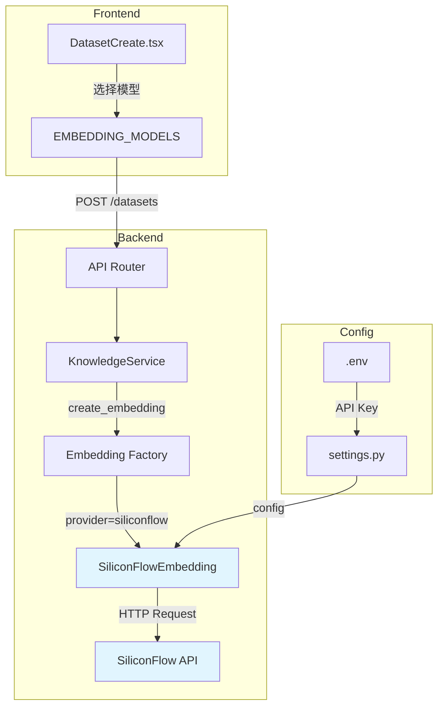

# SiliconFlow 嵌入模型支持计划

## 概述
添加 SiliconFlow (轨迹流动) 嵌入模型支持，包括前端选择和后端完整实现。

## 支持的模型

| 模型名称 | 维度 | 说明 |
|---------|------|------|
| BAAI/bge-m3 | 8192 | 多语言多粒度嵌入模型 |
| Pro/BAAI/bge-m3 | 8192 | BGE-M3 Pro 版本 |
| BAAI/bge-large-zh-v1.5 | 1024 | 中文大型嵌入模型 |
| BAAI/bge-large-en-v1.5 | 1024 | 英文大型嵌入模型 |
| netease-youdao/bce-embedding-base_v1 | 512 | 网易有道基础嵌入模型 |

## API 配置

- **API Endpoint**: `https://api.siliconflow.cn/v1/embeddings`
- **API Key**: configure via environment variable, do not store secrets in the repository

## 修改文件清单

### 1. 后端配置文件

#### `.env`
添加 SiliconFlow API key 配置：
```env
# SiliconFlow 嵌入服务配置
GATEWAY_KNOWLEDGE__SILICONFLOW__API_KEY=${SILICONFLOW_API_KEY}
GATEWAY_KNOWLEDGE__SILICONFLOW__BASE_URL=https://api.siliconflow.cn/v1
```

#### `src/config/settings.py`
添加 SiliconFlow 配置类：
```python
class KnowledgeSiliconFlowSettings(BaseModel):
    """SiliconFlow Embedding API 配置"""
    api_key: str = ""
    base_url: str = "https://api.siliconflow.cn/v1"
    timeout_seconds: float = 30.0
```

在 `KnowledgeSettings` 类中添加：
```python
siliconflow: KnowledgeSiliconFlowSettings = Field(default_factory=KnowledgeSiliconFlowSettings)
```

### 2. 后端嵌入服务

#### `src/services/knowledge/embedding.py`

**新增 SiliconFlowEmbedding 类**：

```python
class SiliconFlowEmbedding(BaseEmbedding):
    """SiliconFlow embedding adapter.

    Uses SiliconFlow API for text embedding with OpenAI-compatible interface.

    API Reference: https://docs.siliconflow.cn/docs/embeddings

    Features:
    - OpenAI-compatible API
    - Support for BGE and other models
    - Configurable HTTP timeout
    - Batch embedding support

    Models:
    - BAAI/bge-m3: 8192 dimensions
    - Pro/BAAI/bge-m3: 8192 dimensions
    - BAAI/bge-large-zh-v1.5: 1024 dimensions
    - BAAI/bge-large-en-v1.5: 1024 dimensions
    - netease-youdao/bce-embedding-base_v1: 512 dimensions
    """

    MODEL_DIMENSIONS: Dict[str, int] = {
        "BAAI/bge-m3": 8192,
        "Pro/BAAI/bge-m3": 8192,
        "BAAI/bge-large-zh-v1.5": 1024,
        "BAAI/bge-large-en-v1.5": 1024,
        "netease-youdao/bce-embedding-base_v1": 512,
    }

    # API endpoint
    SILICONFLOW_API_URL = "https://api.siliconflow.cn/v1/embeddings"

    # API limits
    MAX_BATCH_SIZE = 100
    MAX_RETRIES = 3
    RETRY_BASE_DELAY = 1.0

    def __init__(
        self,
        api_key: str,
        model: str = "BAAI/bge-large-zh-v1.5",
        dimension: Optional[int] = None,
        base_url: Optional[str] = None,
        timeout_seconds: float = 30.0,
    ):
        """Initialize SiliconFlow Embedding.

        Args:
            api_key: SiliconFlow API key
            model: Model name (default: BAAI/bge-large-zh-v1.5)
            dimension: Output dimension (auto-detected from model if not provided)
            base_url: Optional API base URL override
            timeout_seconds: Request timeout
        """
        dim = dimension or self.MODEL_DIMENSIONS.get(model) or 1024
        super().__init__(provider="siliconflow", model=model, dimension=dim)

        if not api_key:
            raise EmbeddingError("SiliconFlow API key is required")

        self.api_key = api_key
        self.base_url = base_url or self.SILICONFLOW_API_URL
        self.timeout_seconds = timeout_seconds
        self._client = httpx.AsyncClient(
            timeout=httpx.Timeout(timeout_seconds, connect=5.0),
            limits=httpx.Limits(max_connections=20, max_keepalive_connections=10),
        )

    async def close(self) -> None:
        """Close the HTTP client."""
        await self._client.aclose()

    async def embed_texts(
        self,
        texts: List[str],
        text_type: Optional[str] = None,
    ) -> List[List[float]]:
        """Embed texts using SiliconFlow API.

        Args:
            texts: List of text strings to embed
            text_type: Not used by SiliconFlow (kept for interface compatibility)

        Returns:
            List of embedding vectors
        """
        if not texts:
            return []

        # Process in batches
        all_vectors: List[List[float]] = []

        for i in range(0, len(texts), self.MAX_BATCH_SIZE):
            batch = texts[i:i + self.MAX_BATCH_SIZE]
            batch_info = f"batch {i // self.MAX_BATCH_SIZE + 1}"

            vectors = await self._embed_batch_with_retry(batch, batch_info)
            all_vectors.extend(vectors)

        return all_vectors

    async def _embed_batch_with_retry(
        self,
        texts: List[str],
        batch_info: str,
    ) -> List[List[float]]:
        """Embed a batch of texts with retry logic."""
        import logging
        logger = logging.getLogger(__name__)

        last_error: Optional[Exception] = None

        for attempt in range(self.MAX_RETRIES):
            try:
                return await self._embed_batch(texts)

            except EmbeddingError as e:
                if "429" in str(e) or "500" in str(e) or "503" in str(e):
                    last_error = e
                    logger.warning(
                        f"SiliconFlow embedding retryable error ({batch_info}) "
                        f"attempt {attempt + 1}/{self.MAX_RETRIES}: {e}"
                    )
                else:
                    raise

            except Exception as exc:
                last_error = EmbeddingError(f"SiliconFlow embedding error ({batch_info}): {exc}")
                logger.warning(
                    f"SiliconFlow embedding error ({batch_info}) "
                    f"attempt {attempt + 1}/{self.MAX_RETRIES}: {exc}"
                )

            # Exponential backoff
            if attempt < self.MAX_RETRIES - 1:
                import random
                delay = self.RETRY_BASE_DELAY * (2 ** attempt)
                delay = delay + random.uniform(0.0, min(0.3, delay))
                await asyncio.sleep(delay)

        raise last_error or EmbeddingError(
            f"SiliconFlow embedding failed after {self.MAX_RETRIES} attempts ({batch_info})"
        )

    async def _embed_batch(
        self,
        texts: List[str],
    ) -> List[List[float]]:
        """Call SiliconFlow embeddings API for a batch of texts."""
        payload = {
            "model": self.model,
            "input": texts,
        }

        response = await self._client.post(
            self.base_url,
            json=payload,
            headers={
                "Authorization": f"Bearer {self.api_key}",
                "Content-Type": "application/json",
            },
        )

        if response.status_code >= 400:
            raise EmbeddingError(
                f"SiliconFlow API error: {response.status_code} - {response.text}"
            )

        data = response.json()

        # Parse response
        embeddings = data.get("data", [])
        if not embeddings:
            raise EmbeddingError("SiliconFlow API returned no embeddings")

        vectors: List[List[float]] = []
        for emb in embeddings:
            values = emb.get("embedding", [])
            if not values:
                raise EmbeddingError("SiliconFlow embedding missing values")
            vectors.append(values)

        if self._dimension is None and vectors:
            self._dimension = len(vectors[0])

        return vectors
```

**更新 create_embedding 工厂函数**：

在 `create_embedding` 函数中添加 siliconflow provider 支持：

```python
def create_embedding(config: EmbeddingConfig, dimension: Optional[int] = None) -> BaseEmbedding:
    provider = (config.provider or "").lower()
    if provider in {"local", "builtin", "hash"}:
        return LocalHashEmbedding(
            model=config.model or "hash-384",
            dimension=dimension or (config.extra or {}).get("dimension"),
        )
    if provider in {"dashscope", "aliyun"}:
        return DashScopeEmbedding(
            model=config.model,
            api_key=config.api_key or "",
            dimension=dimension,
            base_url=config.base_url,
        )
    if provider in {"dashscope_multimodal", "aliyun_multimodal", "multimodal"}:
        return DashScopeMultimodalEmbedding(
            model=config.model or "multimodal-embedding-v1",
            api_key=config.api_key or "",
            dimension=dimension,
            base_url=config.base_url,
        )
    if provider in {"unified_multimodal", "unified", "cross_modal"}:
        return UnifiedMultimodalEmbedding(
            model=config.model or "tongyi-embedding-vision-plus",
            api_key=config.api_key or "",
            dimension=dimension,
            base_url=config.base_url,
            max_concurrent=(config.extra or {}).get("max_concurrent", 5),
        )
    if provider in {"gemini", "google"}:
        return GeminiEmbedding(
            api_key=config.api_key or "",
            model=config.model or "gemini-embedding-001",
            dimension=dimension or 1024,
            base_url=config.base_url,
            timeout_seconds=config.timeout_seconds,
        )
    if provider in {"siliconflow", "silicon", "sf"}:
        return SiliconFlowEmbedding(
            api_key=config.api_key or "",
            model=config.model or "BAAI/bge-large-zh-v1.5",
            dimension=dimension,
            base_url=config.base_url,
            timeout_seconds=config.timeout_seconds,
        )
    if provider in {"openai"}:
        raise EmbeddingError(
            "OpenAI embedding provider has been removed. "
            "Please update your dataset to use 'gemini', 'dashscope', or 'siliconflow'."
        )
    raise EmbeddingError(f"Unsupported embedding provider: {config.provider}")
```

### 3. 前端文件

#### `web/src/pages/knowledge/DatasetCreate.tsx`

更新 `EMBEDDING_MODELS` 常量：

```typescript
const EMBEDDING_MODELS = [
  // Gemini
  { provider: "gemini", model: "gemini-embedding-001", nameKey: "knowledge.create.embeddingGemini001", dimension: 1024 },

  // DashScope
  { provider: "dashscope", model: "text-embedding-v4", nameKey: "knowledge.create.embeddingDashscopeV4", dimension: 1024 },
  { provider: "dashscope", model: "text-embedding-v3", nameKey: "knowledge.create.embeddingDashscopeV3", dimension: 1024 },
  { provider: "dashscope", model: "text-embedding-v2", nameKey: "knowledge.create.embeddingDashscopeV2", dimension: 1536 },

  // SiliconFlow
  { provider: "siliconflow", model: "BAAI/bge-m3", nameKey: "knowledge.create.embeddingBgeM3", dimension: 8192 },
  { provider: "siliconflow", model: "Pro/BAAI/bge-m3", nameKey: "knowledge.create.embeddingBgeM3Pro", dimension: 8192 },
  { provider: "siliconflow", model: "BAAI/bge-large-zh-v1.5", nameKey: "knowledge.create.embeddingBgeLargeZh15", dimension: 1024 },
  { provider: "siliconflow", model: "BAAI/bge-large-en-v1.5", nameKey: "knowledge.create.embeddingBgeLargeEn15", dimension: 1024 },
  { provider: "siliconflow", model: "netease-youdao/bce-embedding-base_v1", nameKey: "knowledge.create.embeddingBceBase", dimension: 512 },
];
```

#### `web/src/i18n/locales/zh-CN.json`

添加中文翻译：

```json
{
  "knowledge": {
    "create": {
      "embeddingBgeM3": "BGE-M3 (8192维)",
      "embeddingBgeM3Pro": "BGE-M3 Pro (8192维)",
      "embeddingBgeLargeZh15": "BGE-Large-ZH v1.5 (1024维)",
      "embeddingBgeLargeEn15": "BGE-Large-EN v1.5 (1024维)",
      "embeddingBceBase": "BCE-Embedding-Base (512维)"
    }
  }
}
```

#### `web/src/i18n/locales/en-US.json`

添加英文翻译：

```json
{
  "knowledge": {
    "create": {
      "embeddingBgeM3": "BGE-M3 (8192D)",
      "embeddingBgeM3Pro": "BGE-M3 Pro (8192D)",
      "embeddingBgeLargeZh15": "BGE-Large-ZH v1.5 (1024D)",
      "embeddingBgeLargeEn15": "BGE-Large-EN v1.5 (1024D)",
      "embeddingBceBase": "BCE-Embedding-Base (512D)"
    }
  }
}
```

## 系统架构图



## 实施步骤

1. ✅ 创建计划文档
2. ⏳ 添加 SiliconFlow 配置到 settings.py
3. ⏳ 添加 SiliconFlow API key 到 .env 文件
4. ⏳ 在 embedding.py 中实现 SiliconFlowEmbedding 类
5. ⏳ 更新 create_embedding 工厂函数支持 siliconflow provider
6. ⏳ 更新前端 DatasetCreate.tsx 中的 EMBEDDING_MODELS 列表
7. ⏳ 添加中文翻译到 zh-CN.json
8. ⏳ 添加英文翻译到 en-US.json
9. ⏳ 验证所有修改是否完整

## 注意事项

1. SiliconFlow 使用 OpenAI 兼容的 API 接口
2. BGE-M3 模型支持 8192 维向量，需要确保 Qdrant 配置支持该维度
3. 不同模型的维度不同，切换模型时需要重建索引
4. API Key 已添加到 .env，生产环境应使用环境变量或密钥管理服务
